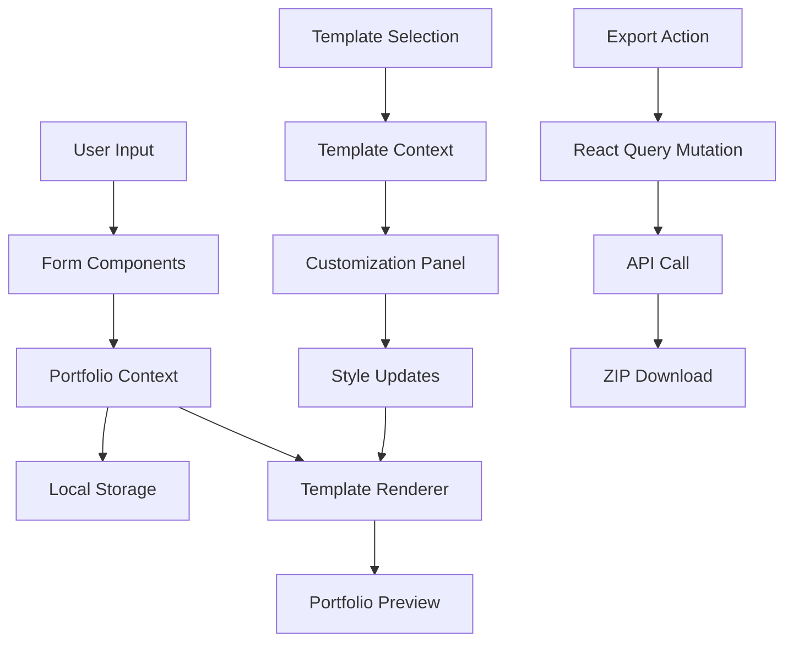
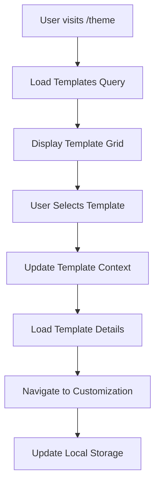
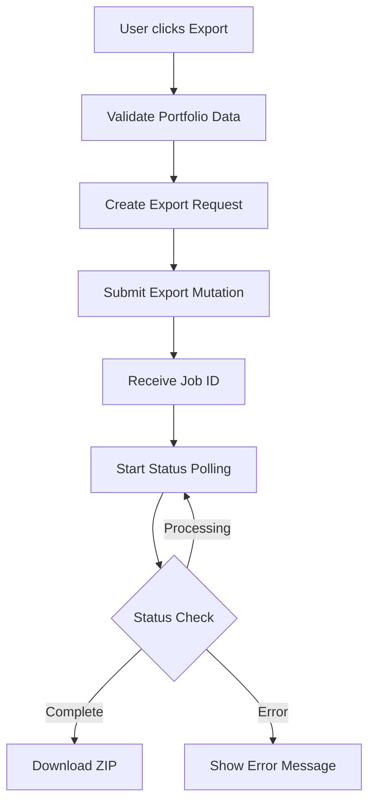

# Portfolio Generator Web App - Architecture Documentation

## Project Overview

A modern Portfolio Generator Web App built with Next.js 14+ App Router, designed for small to medium businesses and agencies. The application allows anonymous users to create professional portfolios through a multi-step process with extensive customization capabilities.

## Technical Stack

- **Framework**: Next.js 14+ (App Router)
- **Language**: TypeScript
- **Styling**: Tailwind CSS
- **UI Components**: ShadCN UI + Radix UI
- **Animations**: Framer Motion
- **State Management**: React Query + Local Storage
- **API Integration**: REST API with JSON responses
- **Drag & Drop**: @dnd-kit/core
- **Form Handling**: React Hook Form + Zod validation

## Project Folder Structure

```
portfolio-generator/
├── README.md
├── next.config.js
├── tailwind.config.js
├── tsconfig.json
├── package.json
├── .env.local
├── .env.example
├── .gitignore
├── .eslintrc.json
├── .prettierrc
├── ARCHITECTURE.md
│
├── public/
│   ├── icons/
│   ├── images/
│   ├── templates/
│   │   ├── previews/
│   │   └── assets/
│   └── favicon.ico
│
├── src/
│   ├── app/                          # Next.js App Router
│   │   ├── globals.css
│   │   ├── layout.tsx
│   │   ├── page.tsx                  # Landing page (/)
│   │   ├── loading.tsx
│   │   ├── error.tsx
│   │   ├── not-found.tsx
│   │   │
│   │   ├── profile/                  # Profile form routes
│   │   │   ├── page.tsx              # Profile form (/profile)
│   │   │   ├── layout.tsx
│   │   │   ├── loading.tsx
│   │   │   └── preview/
│   │   │       └── page.tsx          # Live preview (/profile/preview)
│   │   │
│   │   ├── theme/                    # Theme selector
│   │   │   ├── page.tsx              # Theme selector (/theme)
│   │   │   ├── layout.tsx
│   │   │   └── loading.tsx
│   │   │
│   │   └── api/                      # API routes (if needed)
│   │       ├── export/
│   │       └── templates/
│   │
│   ├── components/                   # Reusable UI components
│   │   ├── ui/                       # ShadCN UI components
│   │   │   ├── button.tsx
│   │   │   ├── input.tsx
│   │   │   ├── card.tsx
│   │   │   ├── dialog.tsx
│   │   │   ├── dropdown-menu.tsx
│   │   │   ├── form.tsx
│   │   │   ├── progress.tsx
│   │   │   ├── tabs.tsx
│   │   │   ├── toast.tsx
│   │   │   └── index.ts
│   │   │
│   │   ├── layout/                   # Layout components
│   │   │   ├── Header.tsx
│   │   │   ├── Footer.tsx
│   │   │   ├── Navigation.tsx
│   │   │   ├── Sidebar.tsx
│   │   │   └── index.ts
│   │   │
│   │   ├── forms/                    # Form-related components
│   │   │   ├── ProfileForm/
│   │   │   │   ├── index.tsx
│   │   │   │   ├── PersonalInfoStep.tsx
│   │   │   │   ├── ExperienceStep.tsx
│   │   │   │   ├── SkillsStep.tsx
│   │   │   │   ├── ProjectsStep.tsx
│   │   │   │   └── FormNavigation.tsx
│   │   │   │
│   │   │   ├── FormField.tsx
│   │   │   ├── FormSection.tsx
│   │   │   ├── StepIndicator.tsx
│   │   │   └── index.ts
│   │   │
│   │   ├── portfolio/                # Portfolio-specific components
│   │   │   ├── templates/            # Template components
│   │   │   │   ├── modern/
│   │   │   │   ├── classic/
│   │   │   │   ├── creative/
│   │   │   │   ├── minimal/
│   │   │   │   └── index.ts
│   │   │   │
│   │   │   ├── sections/             # Portfolio sections
│   │   │   │   ├── HeroSection.tsx
│   │   │   │   ├── AboutSection.tsx
│   │   │   │   ├── ExperienceSection.tsx
│   │   │   │   ├── SkillsSection.tsx
│   │   │   │   ├── ProjectsSection.tsx
│   │   │   │   ├── ContactSection.tsx
│   │   │   │   └── index.ts
│   │   │   │
│   │   │   ├── PortfolioPreview.tsx
│   │   │   ├── TemplateSelector.tsx
│   │   │   ├── CustomizationPanel.tsx
│   │   │   └── index.ts
│   │   │
│   │   ├── editor/                   # Drag & drop editor components
│   │   │   ├── DragDropProvider.tsx
│   │   │   ├── DraggableSection.tsx
│   │   │   ├── DropZone.tsx
│   │   │   ├── SectionEditor.tsx
│   │   │   ├── StyleEditor.tsx
│   │   │   ├── ColorPicker.tsx
│   │   │   ├── FontSelector.tsx
│   │   │   └── index.ts
│   │   │
│   │   ├── common/                   # Common utility components
│   │   │   ├── LoadingSpinner.tsx
│   │   │   ├── ErrorBoundary.tsx
│   │   │   ├── ConfirmDialog.tsx
│   │   │   ├── Toast.tsx
│   │   │   ├── Modal.tsx
│   │   │   ├── Tooltip.tsx
│   │   │   └── index.ts
│   │   │
│   │   └── animations/               # Animation components
│   │       ├── FadeIn.tsx
│   │       ├── SlideIn.tsx
│   │       ├── PageTransition.tsx
│   │       └── index.ts
│   │
│   ├── hooks/                        # Custom React hooks
│   │   ├── useLocalStorage.ts
│   │   ├── usePortfolioData.ts
│   │   ├── useTemplates.ts
│   │   ├── useExport.ts
│   │   ├── useDragDrop.ts
│   │   ├── useDebounce.ts
│   │   ├── useMediaQuery.ts
│   │   └── index.ts
│   │
│   ├── lib/                          # Utility libraries and configurations
│   │   ├── api/                      # API integration
│   │   │   ├── client.ts
│   │   │   ├── endpoints.ts
│   │   │   ├── types.ts
│   │   │   └── queries.ts
│   │   │
│   │   ├── storage/                  # Local storage utilities
│   │   │   ├── portfolioStorage.ts
│   │   │   ├── templateStorage.ts
│   │   │   └── index.ts
│   │   │
│   │   ├── export/                   # Export functionality
│   │   │   ├── zipGenerator.ts
│   │   │   ├── htmlGenerator.ts
│   │   │   ├── cssGenerator.ts
│   │   │   └── index.ts
│   │   │
│   │   ├── validation/               # Form validation schemas
│   │   │   ├── profileSchema.ts
│   │   │   ├── templateSchema.ts
│   │   │   └── index.ts
│   │   │
│   │   ├── utils.ts                  # General utilities
│   │   ├── constants.ts              # App constants
│   │   ├── cn.ts                     # Class name utility
│   │   └── fonts.ts                  # Font configurations
│   │
│   ├── styles/                       # Global styles and themes
│   │   ├── globals.css
│   │   ├── components.css
│   │   ├── themes/
│   │   │   ├── default.css
│   │   │   ├── dark.css
│   │   │   └── custom.css
│   │   └── animations.css
│   │
│   ├── types/                        # TypeScript type definitions
│   │   ├── portfolio.ts
│   │   ├── template.ts
│   │   ├── api.ts
│   │   ├── form.ts
│   │   └── index.ts
│   │
│   ├── data/                         # Static data and configurations
│   │   ├── templates.ts
│   │   ├── defaultPortfolio.ts
│   │   ├── skillCategories.ts
│   │   └── countries.ts
│   │
│   └── providers/                    # Context providers
│       ├── QueryProvider.tsx
│       ├── ThemeProvider.tsx
│       ├── PortfolioProvider.tsx
│       └── index.ts
│
├── docs/                             # Documentation
│   ├── SETUP.md
│   ├── DEPLOYMENT.md
│   ├── API.md
│   └── CONTRIBUTING.md
│
└── tests/                            # Test files
    ├── __mocks__/
    ├── components/
    ├── hooks/
    ├── lib/
    └── setup.ts
```

## Architecture Rationale

### 1. Next.js App Router Structure
- **Rationale**: App Router provides better performance, streaming, and developer experience
- **Benefits**: File-based routing, layout nesting, loading states, error boundaries
- **Trade-offs**: Newer API, some learning curve for developers familiar with Pages Router

### 2. Component Organization
- **UI Components**: Atomic design principles with ShadCN UI as base
- **Feature Components**: Grouped by functionality (forms, portfolio, editor)
- **Layout Components**: Reusable layout structures
- **Benefits**: Clear separation of concerns, easy maintenance, reusability

### 3. State Management Strategy
- **Local State**: React useState/useReducer for component-specific state
- **Global State**: React Query for server state, Local Storage for persistence
- **Rationale**: No authentication means no complex global state needs
- **Benefits**: Simple, performant, works offline

### 4. TypeScript Integration
- **Strict typing**: All components, hooks, and utilities fully typed
- **Type definitions**: Centralized in `/types` directory
- **Benefits**: Better developer experience, fewer runtime errors, better refactoring

This structure supports scalability, maintainability, and follows Next.js 14+ best practices while accommodating the complex drag-and-drop customization requirements.
## Component Hierarchy and Reusability Strategy

### Component Architecture Principles

#### 1. Atomic Design System
```
Atoms (Basic UI Elements)
├── Button, Input, Label, Icon
├── Typography (Heading, Text, Caption)
├── Avatar, Badge, Separator
└── Loading indicators, Spinners

Molecules (Simple Component Groups)
├── FormField (Label + Input + Error)
├── SearchBox (Input + Icon + Button)
├── Card (Header + Content + Footer)
└── Navigation Item (Icon + Text + Badge)

Organisms (Complex Component Groups)
├── Header (Logo + Navigation + Actions)
├── ProfileForm (Multiple FormFields + Navigation)
├── TemplateGrid (Multiple TemplateCards)
└── CustomizationPanel (Multiple Controls)

Templates (Page-level Components)
├── LandingPageTemplate
├── ProfileFormTemplate
├── ThemeSelectorTemplate
└── PreviewTemplate

Pages (Route Components)
├── HomePage (/)
├── ProfilePage (/profile)
├── ThemePage (/theme)
└── PreviewPage (/profile/preview)
```

#### 2. Component Composition Strategy

**Base Components (src/components/ui/)**
- ShadCN UI components as foundation
- Consistent API and styling
- Fully accessible by default
- Customizable through variants and props

**Feature Components (src/components/[feature]/)**
- Business logic components
- Compose base components
- Handle specific functionality
- Reusable across similar contexts

**Layout Components (src/components/layout/)**
- Structural components
- Handle responsive behavior
- Consistent spacing and alignment
- Navigation and page structure

#### 3. Component Reusability Patterns

**Compound Components Pattern**
```typescript
// Example: ProfileForm compound component
<ProfileForm>
  <ProfileForm.Step title="Personal Info">
    <ProfileForm.Field name="name" />
    <ProfileForm.Field name="email" />
  </ProfileForm.Step>
  <ProfileForm.Navigation />
</ProfileForm>
```

**Render Props Pattern**
```typescript
// Example: Template renderer with customization
<TemplateRenderer template={selectedTemplate}>
  {({ sections, customization }) => (
    <div>
      {sections.map(section => (
        <CustomizableSection 
          key={section.id}
          {...section}
          customization={customization}
        />
      ))}
    </div>
  )}
</TemplateRenderer>
```

**Higher-Order Components (HOCs)**
```typescript
// Example: withDragDrop HOC for draggable sections
const DraggableHeroSection = withDragDrop(HeroSection);
const DraggableAboutSection = withDragDrop(AboutSection);
```

#### 4. Portfolio Template Component Architecture

**Template Structure**
```
Template Component
├── TemplateProvider (Context for template data)
├── TemplateLayout (Overall structure)
├── TemplateSection[] (Individual sections)
│   ├── SectionWrapper (Drag/drop functionality)
│   ├── SectionContent (Actual content)
│   └── SectionControls (Edit/customize controls)
└── TemplateExport (Export functionality)
```

**Section Components Hierarchy**
```
Portfolio Sections
├── HeroSection
│   ├── HeroLayout (Structure variants)
│   ├── HeroContent (Name, title, description)
│   └── HeroMedia (Photo, background)
├── AboutSection
│   ├── AboutLayout
│   ├── AboutText
│   └── AboutStats
├── ExperienceSection
│   ├── ExperienceLayout
│   ├── ExperienceItem[]
│   └── ExperienceTimeline
├── SkillsSection
│   ├── SkillsLayout
│   ├── SkillCategory[]
│   └── SkillItem[]
├── ProjectsSection
│   ├── ProjectsLayout
│   ├── ProjectCard[]
│   └── ProjectFilter
└── ContactSection
    ├── ContactLayout
    ├── ContactForm
    └── ContactInfo
```

#### 5. Form Component Architecture

**Multi-Step Form Structure**
```
ProfileForm
├── FormProvider (React Hook Form context)
├── StepIndicator (Progress visualization)
├── FormSteps
│   ├── PersonalInfoStep
│   │   ├── BasicInfoSection
│   │   ├── ContactInfoSection
│   │   └── PhotoUploadSection
│   ├── ExperienceStep
│   │   ├── WorkExperienceSection
│   │   ├── EducationSection
│   │   └── CertificationSection
│   ├── SkillsStep
│   │   ├── TechnicalSkillsSection
│   │   ├── SoftSkillsSection
│   │   └── LanguagesSection
│   └── ProjectsStep
│       ├── ProjectListSection
│       ├── ProjectFormSection
│       └── ProjectMediaSection
├── FormNavigation (Previous/Next buttons)
└── FormValidation (Zod schema validation)
```

#### 6. Customization Component Architecture

**Style Editor Components**
```
CustomizationPanel
├── StyleTabs (Colors, Fonts, Layout, Spacing)
├── ColorCustomization
│   ├── ColorPicker
│   ├── ColorPalette
│   └── ColorPresets
├── FontCustomization
│   ├── FontSelector
│   ├── FontSizeSlider
│   └── FontWeightSelector
├── LayoutCustomization
│   ├── SectionOrderEditor
│   ├── ColumnLayoutSelector
│   └── SpacingControls
└── CustomCSSEditor
    ├── CSSInput
    ├── CSSPreview
    └── CSSValidator
```

#### 7. Component Props and API Design

**Consistent Props Pattern**
```typescript
interface BaseComponentProps {
  className?: string;
  children?: React.ReactNode;
  variant?: string;
  size?: 'sm' | 'md' | 'lg';
  disabled?: boolean;
  loading?: boolean;
}

interface PortfolioSectionProps extends BaseComponentProps {
  data: SectionData;
  customization: SectionCustomization;
  editable?: boolean;
  onEdit?: (data: SectionData) => void;
  onCustomize?: (customization: SectionCustomization) => void;
}
```

**Event Handling Pattern**
```typescript
interface ComponentEventHandlers {
  onClick?: (event: MouseEvent) => void;
  onChange?: (value: any) => void;
  onSubmit?: (data: FormData) => void;
  onError?: (error: Error) => void;
  onSuccess?: (result: any) => void;
}
```

#### 8. Component Testing Strategy

**Component Categories and Testing Approach**
- **UI Components**: Visual regression tests, accessibility tests
- **Form Components**: User interaction tests, validation tests
- **Portfolio Components**: Rendering tests, customization tests
- **Layout Components**: Responsive tests, navigation tests

#### 9. Performance Optimization for Components

**Code Splitting Strategy**
- Lazy load template components
- Dynamic imports for heavy customization panels
- Separate bundles for different template categories

**Memoization Strategy**
- React.memo for pure components
- useMemo for expensive calculations
- useCallback for event handlers

**Bundle Optimization**
- Tree-shaking for unused components
- Component-level code splitting
- Optimized re-renders with proper dependencies

This component hierarchy ensures maximum reusability, maintainability, and performance while supporting the complex customization requirements of the portfolio generator.

## State Management Architecture

### State Management Strategy Overview

Given the anonymous user model and local storage requirements, the state management approach combines:
- **Local Component State**: React useState/useReducer for UI state
- **React Query**: Server state management and caching
- **Local Storage**: Data persistence without authentication
- **Context API**: Shared state for portfolio data and customization

### State Architecture Layers

#### 1. Local Storage Layer
```typescript
// Portfolio data persistence
interface PortfolioStorage {
  portfolioData: PortfolioData;
  templateId: string;
  customization: CustomizationSettings;
  lastModified: Date;
  version: string;
}

// Storage utilities
class PortfolioStorageManager {
  save(data: PortfolioStorage): void;
  load(): PortfolioStorage | null;
  clear(): void;
  backup(): string; // JSON export
  restore(backup: string): boolean;
}
```

#### 2. React Query Layer
```typescript
// API queries and mutations
const portfolioQueries = {
  templates: () => useQuery(['templates'], fetchTemplates),
  templateById: (id: string) => useQuery(['template', id], () => fetchTemplate(id)),
  export: () => useMutation(exportPortfolio),
};

// Query configuration
const queryClient = new QueryClient({
  defaultOptions: {
    queries: {
      staleTime: 5 * 60 * 1000, // 5 minutes
      cacheTime: 10 * 60 * 1000, // 10 minutes
      retry: 2,
    },
  },
});
```

#### 3. Context Providers Layer
```typescript
// Portfolio data context
interface PortfolioContextValue {
  portfolioData: PortfolioData;
  updatePortfolioData: (data: Partial<PortfolioData>) => void;
  resetPortfolioData: () => void;
  isLoading: boolean;
  isDirty: boolean;
}

// Template context
interface TemplateContextValue {
  selectedTemplate: Template | null;
  setSelectedTemplate: (template: Template) => void;
  customization: CustomizationSettings;
  updateCustomization: (settings: Partial<CustomizationSettings>) => void;
}

// Form context
interface FormContextValue {
  currentStep: number;
  totalSteps: number;
  goToStep: (step: number) => void;
  nextStep: () => void;
  previousStep: () => void;
  isStepValid: (step: number) => boolean;
}
```

### Data Flow Architecture

#### 1. Portfolio Data Flow


#### 2. State Synchronization Strategy
```typescript
// Auto-save hook
const useAutoSave = (data: PortfolioData, delay: number = 1000) => {
  const debouncedSave = useDebounce(data, delay);
  
  useEffect(() => {
    if (debouncedSave) {
      portfolioStorage.save(debouncedSave);
    }
  }, [debouncedSave]);
};

// State hydration on app load
const usePortfolioHydration = () => {
  const [isHydrated, setIsHydrated] = useState(false);
  const { updatePortfolioData } = usePortfolioContext();
  
  useEffect(() => {
    const savedData = portfolioStorage.load();
    if (savedData) {
      updatePortfolioData(savedData.portfolioData);
    }
    setIsHydrated(true);
  }, []);
  
  return isHydrated;
};
```

### Custom Hooks for State Management

#### 1. Portfolio Data Hooks
```typescript
// Main portfolio data hook
const usePortfolioData = () => {
  const context = useContext(PortfolioContext);
  if (!context) {
    throw new Error('usePortfolioData must be used within PortfolioProvider');
  }
  return context;
};

// Specific section hooks
const usePersonalInfo = () => {
  const { portfolioData, updatePortfolioData } = usePortfolioData();
  return {
    personalInfo: portfolioData.personalInfo,
    updatePersonalInfo: (info: Partial<PersonalInfo>) =>
      updatePortfolioData({ personalInfo: { ...portfolioData.personalInfo, ...info } }),
  };
};

const useExperience = () => {
  const { portfolioData, updatePortfolioData } = usePortfolioData();
  return {
    experience: portfolioData.experience,
    addExperience: (exp: Experience) =>
      updatePortfolioData({ experience: [...portfolioData.experience, exp] }),
    updateExperience: (id: string, exp: Partial<Experience>) =>
      updatePortfolioData({
        experience: portfolioData.experience.map(e => e.id === id ? { ...e, ...exp } : e),
      }),
    removeExperience: (id: string) =>
      updatePortfolioData({
        experience: portfolioData.experience.filter(e => e.id !== id),
      }),
  };
};
```

#### 2. Template and Customization Hooks
```typescript
const useTemplate = () => {
  const { selectedTemplate, setSelectedTemplate } = useContext(TemplateContext);
  const { data: templates, isLoading } = useQuery(['templates'], fetchTemplates);
  
  return {
    selectedTemplate,
    templates,
    isLoading,
    selectTemplate: setSelectedTemplate,
  };
};

const useCustomization = () => {
  const { customization, updateCustomization } = useContext(TemplateContext);
  
  return {
    customization,
    updateColors: (colors: ColorScheme) =>
      updateCustomization({ colors }),
    updateFonts: (fonts: FontSettings) =>
      updateCustomization({ fonts }),
    updateLayout: (layout: LayoutSettings) =>
      updateCustomization({ layout }),
    resetCustomization: () =>
      updateCustomization(getDefaultCustomization()),
  };
};
```

#### 3. Form State Hooks
```typescript
const useFormNavigation = () => {
  const context = useContext(FormContext);
  return {
    ...context,
    canGoNext: context.currentStep < context.totalSteps && context.isStepValid(context.currentStep),
    canGoPrevious: context.currentStep > 1,
  };
};

const useFormValidation = () => {
  const { portfolioData } = usePortfolioData();
  
  return {
    validateStep: (step: number) => {
      switch (step) {
        case 1: return validatePersonalInfo(portfolioData.personalInfo);
        case 2: return validateExperience(portfolioData.experience);
        case 3: return validateSkills(portfolioData.skills);
        case 4: return validateProjects(portfolioData.projects);
        default: return true;
      }
    },
    validateAll: () => {
      return [1, 2, 3, 4].every(step => validateStep(step));
    },
  };
};
```

### Performance Optimizations

#### 1. Selective Re-renders
```typescript
// Memoized context values
const PortfolioProvider: React.FC<{ children: React.ReactNode }> = ({ children }) => {
  const [portfolioData, setPortfolioData] = useState<PortfolioData>(defaultPortfolioData);
  
  const contextValue = useMemo(() => ({
    portfolioData,
    updatePortfolioData: (data: Partial<PortfolioData>) =>
      setPortfolioData(prev => ({ ...prev, ...data })),
    resetPortfolioData: () => setPortfolioData(defaultPortfolioData),
  }), [portfolioData]);
  
  return (
    <PortfolioContext.Provider value={contextValue}>
      {children}
    </PortfolioContext.Provider>
  );
};
```

#### 2. Optimistic Updates
```typescript
const useOptimisticExport = () => {
  const queryClient = useQueryClient();
  
  return useMutation(exportPortfolio, {
    onMutate: async (portfolioData) => {
      // Cancel outgoing refetches
      await queryClient.cancelQueries(['export']);
      
      // Snapshot previous value
      const previousData = queryClient.getQueryData(['export']);
      
      // Optimistically update
      queryClient.setQueryData(['export'], { status: 'exporting' });
      
      return { previousData };
    },
    onError: (err, variables, context) => {
      // Rollback on error
      if (context?.previousData) {
        queryClient.setQueryData(['export'], context.previousData);
      }
    },
    onSettled: () => {
      // Refetch after mutation
      queryClient.invalidateQueries(['export']);
    },
  });
};
```

This state management architecture provides a robust, performant solution that handles the complex requirements of portfolio data management, template customization, and local persistence without requiring user authentication.

## API Integration Patterns and Data Flow

### API Architecture Overview

The application integrates with a REST API for template data, export functionality, and potential future features. The integration follows modern patterns with React Query for caching and state management.

### API Client Configuration

#### 1. Base API Client
```typescript
// lib/api/client.ts
class APIClient {
  private baseURL: string;
  private defaultHeaders: Record<string, string>;
  
  constructor(baseURL: string) {
    this.baseURL = baseURL;
    this.defaultHeaders = {
      'Content-Type': 'application/json',
    };
  }
  
  private async request<T>(
    endpoint: string,
    options: RequestInit = {}
  ): Promise<T> {
    const url = `${this.baseURL}${endpoint}`;
    const config: RequestInit = {
      headers: { ...this.defaultHeaders, ...options.headers },
      ...options,
    };
    
    const response = await fetch(url, config);
    
    if (!response.ok) {
      throw new APIError(response.status, response.statusText);
    }
    
    return response.json();
  }
  
  get<T>(endpoint: string, params?: Record<string, string>): Promise<T> {
    const url = params ? `${endpoint}?${new URLSearchParams(params)}` : endpoint;
    return this.request<T>(url);
  }
  
  post<T>(endpoint: string, data: any): Promise<T> {
    return this.request<T>(endpoint, {
      method: 'POST',
      body: JSON.stringify(data),
    });
  }
  
  put<T>(endpoint: string, data: any): Promise<T> {
    return this.request<T>(endpoint, {
      method: 'PUT',
      body: JSON.stringify(data),
    });
  }
  
  delete<T>(endpoint: string): Promise<T> {
    return this.request<T>(endpoint, { method: 'DELETE' });
  }
}

export const apiClient = new APIClient(process.env.NEXT_PUBLIC_API_URL!);
```

#### 2. API Endpoints Configuration
```typescript
// lib/api/endpoints.ts
export const API_ENDPOINTS = {
  // Template endpoints
  TEMPLATES: '/templates',
  TEMPLATE_BY_ID: (id: string) => `/templates/${id}`,
  TEMPLATE_PREVIEW: (id: string) => `/templates/${id}/preview`,
  
  // Export endpoints
  EXPORT_PORTFOLIO: '/export/portfolio',
  EXPORT_STATUS: (jobId: string) => `/export/status/${jobId}`,
  EXPORT_DOWNLOAD: (jobId: string) => `/export/download/${jobId}`,
  
  // Asset endpoints
  UPLOAD_IMAGE: '/assets/upload',
  OPTIMIZE_IMAGE: '/assets/optimize',
  
  // Utility endpoints
  HEALTH: '/health',
  VERSION: '/version',
} as const;
```

### React Query Integration

#### 1. Query Configurations
```typescript
// lib/api/queries.ts
export const templateQueries = {
  all: () => ['templates'] as const,
  lists: () => [...templateQueries.all(), 'list'] as const,
  list: (filters: TemplateFilters) => [...templateQueries.lists(), filters] as const,
  details: () => [...templateQueries.all(), 'detail'] as const,
  detail: (id: string) => [...templateQueries.details(), id] as const,
};

export const exportQueries = {
  all: () => ['export'] as const,
  jobs: () => [...exportQueries.all(), 'jobs'] as const,
  job: (jobId: string) => [...exportQueries.jobs(), jobId] as const,
};

// Query functions
export const useTemplates = (filters?: TemplateFilters) => {
  return useQuery({
    queryKey: templateQueries.list(filters || {}),
    queryFn: () => apiClient.get<Template[]>(API_ENDPOINTS.TEMPLATES, filters),
    staleTime: 5 * 60 * 1000, // 5 minutes
    cacheTime: 10 * 60 * 1000, // 10 minutes
  });
};

export const useTemplate = (id: string) => {
  return useQuery({
    queryKey: templateQueries.detail(id),
    queryFn: () => apiClient.get<Template>(API_ENDPOINTS.TEMPLATE_BY_ID(id)),
    enabled: !!id,
    staleTime: 10 * 60 * 1000, // 10 minutes
  });
};
```

#### 2. Mutation Configurations
```typescript
// Export mutations
export const useExportPortfolio = () => {
  const queryClient = useQueryClient();
  
  return useMutation({
    mutationFn: (data: ExportRequest) =>
      apiClient.post<ExportResponse>(API_ENDPOINTS.EXPORT_PORTFOLIO, data),
    onSuccess: (data) => {
      // Cache the export job
      queryClient.setQueryData(exportQueries.job(data.jobId), data);
      
      // Start polling for status
      queryClient.invalidateQueries(exportQueries.job(data.jobId));
    },
    onError: (error) => {
      console.error('Export failed:', error);
    },
  });
};

export const useExportStatus = (jobId: string, enabled: boolean = true) => {
  return useQuery({
    queryKey: exportQueries.job(jobId),
    queryFn: () => apiClient.get<ExportStatus>(API_ENDPOINTS.EXPORT_STATUS(jobId)),
    enabled: enabled && !!jobId,
    refetchInterval: (data) => {
      // Poll every 2 seconds if still processing
      return data?.status === 'processing' ? 2000 : false;
    },
    refetchIntervalInBackground: true,
  });
};

// Image upload mutation
export const useImageUpload = () => {
  return useMutation({
    mutationFn: (file: File) => {
      const formData = new FormData();
      formData.append('image', file);
      
      return fetch(API_ENDPOINTS.UPLOAD_IMAGE, {
        method: 'POST',
        body: formData,
      }).then(res => res.json());
    },
    onSuccess: (data) => {
      // Handle successful upload
      console.log('Image uploaded:', data);
    },
  });
};
```

### Data Flow Patterns

#### 1. Template Selection Flow


#### 2. Export Flow


### Error Handling Strategy

#### 1. API Error Types
```typescript
// lib/api/types.ts
export class APIError extends Error {
  constructor(
    public status: number,
    public statusText: string,
    public data?: any
  ) {
    super(`API Error ${status}: ${statusText}`);
    this.name = 'APIError';
  }
}

export interface ErrorResponse {
  error: {
    code: string;
    message: string;
    details?: Record<string, any>;
  };
  timestamp: string;
  path: string;
}
```

#### 2. Error Handling Hooks
```typescript
// hooks/useErrorHandler.ts
export const useErrorHandler = () => {
  const showToast = useToast();
  
  const handleError = useCallback((error: unknown) => {
    if (error instanceof APIError) {
      switch (error.status) {
        case 400:
          showToast({
            title: 'Invalid Request',
            description: 'Please check your input and try again.',
            variant: 'destructive',
          });
          break;
        case 404:
          showToast({
            title: 'Not Found',
            description: 'The requested resource was not found.',
            variant: 'destructive',
          });
          break;
        case 500:
          showToast({
            title: 'Server Error',
            description: 'Something went wrong. Please try again later.',
            variant: 'destructive',
          });
          break;
        default:
          showToast({
            title: 'Error',
            description: error.message,
            variant: 'destructive',
          });
      }
    } else {
      showToast({
        title: 'Unexpected Error',
        description: 'An unexpected error occurred.',
        variant: 'destructive',
      });
    }
  }, [showToast]);
  
  return { handleError };
};
```

#### 3. Query Error Boundaries
```typescript
// components/common/QueryErrorBoundary.tsx
export const QueryErrorBoundary: React.FC<{ children: React.ReactNode }> = ({ children }) => {
  return (
    <ErrorBoundary
      fallback={({ error, resetError }) => (
        <div className="flex flex-col items-center justify-center min-h-[400px] space-y-4">
          <h2 className="text-xl font-semibold">Something went wrong</h2>
          <p className="text-muted-foreground text-center max-w-md">
            {error instanceof APIError 
              ? 'Unable to load data. Please check your connection and try again.'
              : 'An unexpected error occurred.'
            }
          </p>
          <Button onClick={resetError}>Try Again</Button>
        </div>
      )}
      onError={(error) => {
        console.error('Query Error:', error);
      }}
    >
      {children}
    </ErrorBoundary>
  );
};
```

### Caching Strategy

#### 1. Cache Configuration
```typescript
// lib/api/cache.ts
export const cacheConfig = {
  templates: {
    staleTime: 5 * 60 * 1000, // 5 minutes
    cacheTime: 30 * 60 * 1000, // 30 minutes
  },
  templateDetails: {
    staleTime: 10 * 60 * 1000, // 10 minutes
    cacheTime: 60 * 60 * 1000, // 1 hour
  },
  export: {
    staleTime: 0, // Always fresh
    cacheTime: 5 * 60 * 1000, // 5 minutes
  },
};
```

#### 2. Cache Invalidation
```typescript
// hooks/useCacheInvalidation.ts
export const useCacheInvalidation = () => {
  const queryClient = useQueryClient();
  
  return {
    invalidateTemplates: () => {
      queryClient.invalidateQueries(templateQueries.all());
    },
    invalidateTemplate: (id: string) => {
      queryClient.invalidateQueries(templateQueries.detail(id));
    },
    clearExportCache: () => {
      queryClient.removeQueries(exportQueries.all());
    },
    clearAllCache: () => {
      queryClient.clear();
    },
  };
};
```

This API integration architecture provides robust error handling, efficient caching, and optimistic updates while maintaining good performance and user experience.
## Styling and Theming System Architecture

### Styling Strategy Overview

The application uses a comprehensive styling system built on Tailwind CSS with ShadCN UI components, supporting extensive customization capabilities for portfolio templates while maintaining design consistency and performance.

### Core Styling Architecture

#### 1. Tailwind CSS Configuration
```typescript
// tailwind.config.js
module.exports = {
  content: [
    './src/pages/**/*.{js,ts,jsx,tsx,mdx}',
    './src/components/**/*.{js,ts,jsx,tsx,mdx}',
    './src/app/**/*.{js,ts,jsx,tsx,mdx}',
  ],
  theme: {
    extend: {
      colors: {
        // Custom color system for portfolio templates
        portfolio: {
          primary: 'hsl(var(--portfolio-primary))',
          secondary: 'hsl(var(--portfolio-secondary))',
          accent: 'hsl(var(--portfolio-accent))',
          muted: 'hsl(var(--portfolio-muted))',
          background: 'hsl(var(--portfolio-background))',
          foreground: 'hsl(var(--portfolio-foreground))',
        },
        // ShadCN UI color system
        border: 'hsl(var(--border))',
        input: 'hsl(var(--input))',
        ring: 'hsl(var(--ring))',
        background: 'hsl(var(--background))',
        foreground: 'hsl(var(--foreground))',
        primary: {
          DEFAULT: 'hsl(var(--primary))',
          foreground: 'hsl(var(--primary-foreground))',
        },
        secondary: {
          DEFAULT: 'hsl(var(--secondary))',
          foreground: 'hsl(var(--secondary-foreground))',
        },
        destructive: {
          DEFAULT: 'hsl(var(--destructive))',
          foreground: 'hsl(var(--destructive-foreground))',
        },
        muted: {
          DEFAULT: 'hsl(var(--muted))',
          foreground: 'hsl(var(--muted-foreground))',
        },
        accent: {
          DEFAULT: 'hsl(var(--accent))',
          foreground: 'hsl(var(--accent-foreground))',
        },
        popover: {
          DEFAULT: 'hsl(var(--popover))',
          foreground: 'hsl(var(--popover-foreground))',
        },
        card: {
          DEFAULT: 'hsl(var(--card))',
          foreground: 'hsl(var(--card-foreground))',
        },
      },
      fontFamily: {
        sans: ['var(--font-inter)', 'system-ui', 'sans-serif'],
        serif: ['var(--font-playfair)', 'Georgia', 'serif'],
        mono: ['var(--font-jetbrains)', 'Consolas', 'monospace'],
        // Portfolio-specific fonts
        heading: ['var(--portfolio-font-heading)', 'system-ui', 'sans-serif'],
        body: ['var(--portfolio-font-body)', 'system-ui', 'sans-serif'],
      },
      spacing: {
        // Portfolio-specific spacing scale
        'portfolio-xs': 'var(--portfolio-spacing-xs)',
        'portfolio-sm': 'var(--portfolio-spacing-sm)',
        'portfolio-md': 'var(--portfolio-spacing-md)',
        'portfolio-lg': 'var(--portfolio-spacing-lg)',
        'portfolio-xl': 'var(--portfolio-spacing-xl)',
      },
      animation: {
        'fade-in': 'fadeIn 0.5s ease-in-out',
        'slide-up': 'slideUp 0.3s ease-out',
        'slide-down': 'slideDown 0.3s ease-out',
        'scale-in': 'scaleIn 0.2s ease-out',
      },
      keyframes: {
        fadeIn: {
          '0%': { opacity: '0' },
          '100%': { opacity: '1' },
        },
        slideUp: {
          '0%': { transform: 'translateY(10px)', opacity: '0' },
          '100%': { transform: 'translateY(0)', opacity: '1' },
        },
        slideDown: {
          '0%': { transform: 'translateY(-10px)', opacity: '0' },
          '100%': { transform: 'translateY(0)', opacity: '1' },
        },
        scaleIn: {
          '0%': { transform: 'scale(0.95)', opacity: '0' },
          '100%': { transform: 'scale(1)', opacity: '1' },
        },
      },
    },
  },
  plugins: [
    require('tailwindcss-animate'),
    require('@tailwindcss/typography'),
    require('@tailwindcss/forms'),
  ],
};
```

#### 2. CSS Custom Properties System
```css
/* styles/globals.css */
:root {
  /* ShadCN UI Variables */
  --background: 0 0% 100%;
  --foreground: 222.2 84% 4.9%;
  --card: 0 0% 100%;
  --card-foreground: 222.2 84% 4.9%;
  --popover: 0 0% 100%;
  --popover-foreground: 222.2 84% 4.9%;
  --primary: 222.2 47.4% 11.2%;
  --primary-foreground: 210 40% 98%;
  --secondary: 210 40% 96%;
  --secondary-foreground: 222.2 84% 4.9%;
  --muted: 210 40% 96%;
  --muted-foreground: 215.4 16.3% 46.9%;
  --accent: 210 40% 96%;
  --accent-foreground: 222.2 84% 4.9%;
  --destructive: 0 84.2% 60.2%;
  --destructive-foreground: 210 40% 98%;
  --border: 214.3 31.8% 91.4%;
  --input: 214.3 31.8% 91.4%;
  --ring: 222.2 84% 4.9%;
  --radius: 0.5rem;
  
  /* Portfolio Template Variables */
  --portfolio-primary: 222.2 47.4% 11.2%;
  --portfolio-secondary: 210 40% 96%;
  --portfolio-accent: 142.1 76.2% 36.3%;
  --portfolio-muted: 210 40% 96%;
  --portfolio-background: 0 0% 100%;
  --portfolio-foreground: 222.2 84% 4.9%;
  
  /* Typography Variables */
  --portfolio-font-heading: 'Inter', system-ui, sans-serif;
  --portfolio-font-body: 'Inter', system-ui, sans-serif;
  --portfolio-font-size-xs: 0.75rem;
  --portfolio-font-size-sm: 0.875rem;
  --portfolio-font-size-base: 1rem;
  --portfolio-font-size-lg: 1.125rem;
  --portfolio-font-size-xl: 1.25rem;
  --portfolio-font-size-2xl: 1.5rem;
  --portfolio-font-size-3xl: 1.875rem;
  --portfolio-font-size-4xl: 2.25rem;
  
  /* Spacing Variables */
  --portfolio-spacing-xs: 0.5rem;
  --portfolio-spacing-sm: 1rem;
  --portfolio-spacing-md: 1.5rem;
  --portfolio-spacing-lg: 2rem;
  --portfolio-spacing-xl: 3rem;
}

.dark {
  --background: 222.2 84% 4.9%;
  --foreground: 210 40% 98%;
  --card: 222.2 84% 4.9%;
  --card-foreground: 210 40% 98%;
  --popover: 222.2 84% 4.9%;
  --popover-foreground: 210 40% 98%;
  --primary: 210 40% 98%;
  --primary-foreground: 222.2 47.4% 11.2%;
  --secondary: 217.2 32.6% 17.5%;
  --secondary-foreground: 210 40% 98%;
  --muted: 217.2 32.6% 17.5%;
  --muted-foreground: 215 20.2% 65.1%;
  --accent: 217.2 32.6% 17.5%;
  --accent-foreground: 210 40% 98%;
  --destructive: 0 62.8% 30.6%;
  --destructive-foreground: 210 40% 98%;
  --border: 217.2 32.6% 17.5%;
  --input: 217.2 32.6% 17.5%;
  --ring: 212.7 26.8% 83.9%;
  
  /* Dark mode portfolio variables */
  --portfolio-background: 222.2 84% 4.9%;
  --portfolio-foreground: 210 40% 98%;
}
```

### Theme System Architecture

#### 1. Theme Provider Implementation
```typescript
// providers/ThemeProvider.tsx
interface ThemeContextValue {
  theme: 'light' | 'dark' | 'system';
  setTheme: (theme: 'light' | 'dark' | 'system') => void;
  portfolioTheme: PortfolioTheme;
  updatePortfolioTheme: (theme: Partial<PortfolioTheme>) => void;
  resetPortfolioTheme: () => void;
}

interface PortfolioTheme {
  colors: ColorScheme;
  fonts: FontSettings;
  spacing: SpacingSettings;
  layout: LayoutSettings;
}

interface ColorScheme {
  primary: string;
  secondary: string;
  accent: string;
  background: string;
  foreground: string;
  muted: string;
}

interface FontSettings {
  heading: {
    family: string;
    weight: number;
    size: FontSizeScale;
  };
  body: {
    family: string;
    weight: number;
    size: FontSizeScale;
  };
  lineHeight: {
    tight: number;
    normal: number;
    relaxed: number;
  };
}

interface SpacingSettings {
  scale: 'compact' | 'normal' | 'spacious';
  sectionGap: string;
  elementGap: string;
  containerPadding: string;
}

const ThemeProvider: React.FC<{ children: React.ReactNode }> = ({ children }) => {
  const [theme, setTheme] = useState<'light' | 'dark' | 'system'>('system');
  const [portfolioTheme, setPortfolioTheme] = useState<PortfolioTheme>(defaultPortfolioTheme);
  
  // Apply theme to document
  useEffect(() => {
    const root = document.documentElement;
    const systemTheme = window.matchMedia('(prefers-color-scheme: dark)').matches ? 'dark' : 'light';
    const effectiveTheme = theme === 'system' ? systemTheme : theme;
    
    root.classList.remove('light', 'dark');
    root.classList.add(effectiveTheme);
  }, [theme]);
  
  // Apply portfolio theme variables
  useEffect(() => {
    const root = document.documentElement;
    
    // Apply color variables
    Object.entries(portfolioTheme.colors).forEach(([key, value]) => {
      root.style.setProperty(`--portfolio-${key}`, value);
    });
    
    // Apply font variables
    root.style.setProperty('--portfolio-font-heading', portfolioTheme.fonts.heading.family);
    root.style.setProperty('--portfolio-font-body', portfolioTheme.fonts.body.family);
    
    // Apply spacing variables
    const spacingMultiplier = {
      compact: 0.8,
      normal: 1,
      spacious: 1.2,
    }[portfolioTheme.spacing.scale];
    
    root.style.setProperty('--portfolio-spacing-xs', `${0.5 * spacingMultiplier}rem`);
    root.style.setProperty('--portfolio-spacing-sm', `${1 * spacingMultiplier}rem`);
    root.style.setProperty('--portfolio-spacing-md', `${1.5 * spacingMultiplier}rem`);
    root.style.setProperty('--portfolio-spacing-lg', `${2 * spacingMultiplier}rem`);
    root.style.setProperty('--portfolio-spacing-xl', `${3 * spacingMultiplier}rem`);
  }, [portfolioTheme]);
  
  const updatePortfolioTheme = useCallback((updates: Partial<PortfolioTheme>) => {
    setPortfolioTheme(prev => ({ ...prev, ...updates }));
  }, []);
  
  const resetPortfolioTheme = useCallback(() => {
    setPortfolioTheme(defaultPortfolioTheme);
  }, []);
  
  return (
    <ThemeContext.Provider value={{
      theme,
      setTheme,
      portfolioTheme,
      updatePortfolioTheme,
      resetPortfolioTheme,
    }}>
      {children}
    </ThemeContext.Provider>
  );
};
```

#### 2. Template-Specific Styling System
```typescript
// lib/styling/templateStyles.ts
export interface TemplateStyleConfig {
  id: string;
  name: string;
  category: 'modern' | 'classic' | 'creative' | 'minimal';
  baseStyles: {
    colors: ColorScheme;
    fonts: FontSettings;
    spacing: SpacingSettings;
    layout: LayoutSettings;
  };
  sectionStyles: Record<string, SectionStyleConfig>;
  customizations: CustomizationOptions;
}

export interface SectionStyleConfig {
  container: string; // Tailwind classes
  content: string;
  title: string;
  subtitle: string;
  text: string;
  accent: string;
}

export interface CustomizationOptions {
  colors: {
    primary: { customizable: boolean; presets: string[] };
    secondary: { customizable: boolean; presets: string[] };
    accent: { customizable: boolean; presets: string[] };
  };
  fonts: {
    heading: { customizable: boolean; options: FontOption[] };
    body: { customizable: boolean; options: FontOption[] };
  };
  layout: {
    sectionOrder: { customizable: boolean };
    columnLayout: { customizable: boolean; options: LayoutOption[] };
    spacing: { customizable: boolean; range: [number, number] };
  };
}

// Template style generator
export class TemplateStyleGenerator {
  private config: TemplateStyleConfig;
  
  constructor(config: TemplateStyleConfig) {
    this.config = config;
  }
  
  generateCSS(customization: PortfolioTheme): string {
    const { colors, fonts, spacing } = customization;
    
    return `
      .portfolio-template-${this.config.id} {
        --template-primary: ${colors.primary};
        --template-secondary: ${colors.secondary};
        --template-accent: ${colors.accent};
        --template-background: ${colors.background};
        --template-foreground: ${colors.foreground};
        
        --template-font-heading: ${fonts.heading.family};
        --template-font-body: ${fonts.body.family};
        
        --template-spacing-scale: ${spacing.scale === 'compact' ? '0.8' : spacing.scale === 'spacious' ? '1.2' : '1'};
      }
      
      ${this.generateSectionStyles()}
      ${this.generateResponsiveStyles()}
    `;
  }
  
  private generateSectionStyles(): string {
    return Object.entries(this.config.sectionStyles)
      .map(([section, styles]) => `
        .portfolio-section-${section} {
          ${this.convertTailwindToCSS(styles.container)}
        }
        
        .portfolio-section-${section} .section-title {
          ${this.convertTailwindToCSS(styles.title)}
        }
        
        .portfolio-section-${section} .section-content {
          ${this.convertTailwindToCSS(styles.content)}
        }
      `)
      .join('\n');
  }
  
  private generateResponsiveStyles(): string {
    return `
      @media (max-width: 768px) {
        .portfolio-template-${this.config.id} {
          --template-spacing-scale: calc(var(--template-spacing-scale) * 0.8);
        }
      }
      
      @media (max-width: 480px) {
        .portfolio-template-${this.config.id} {
          --template-spacing-scale: calc(var(--template-spacing-scale) * 0.6);
        }
      }
    `;
  }
  
  private convertTailwindToCSS(tailwindClasses: string): string {
    // Convert Tailwind classes to CSS properties
    // This would be implemented based on specific needs
    return tailwindClasses;
  }
}
```

### Component Styling Patterns

#### 1. Styled Component Variants
```typescript
// components/ui/styled-components.ts
import { cva, type VariantProps } from 'class-variance-authority';

// Button variants for portfolio templates
export const portfolioButtonVariants = cva(
  'inline-flex items-center justify-center rounded-md text-sm font-medium transition-colors focus-visible:outline-none focus-visible:ring-2 focus-visible:ring-ring focus-visible:ring-offset-2 disabled:opacity-50 disabled:pointer-events-none ring-offset-background',
  {
    variants: {
      variant: {
        default: 'bg-portfolio-primary text-portfolio-primary-foreground hover:bg-portfolio-primary/90',
        destructive: 'bg-destructive text-destructive-foreground hover:bg-destructive/90',
        outline: 'border border-portfolio-primary text-portfolio-primary hover:bg-portfolio-primary hover:text-portfolio-primary-foreground',
        secondary: 'bg-portfolio-secondary text-portfolio-secondary-foreground hover:bg-portfolio-secondary/80',
        ghost: 'hover:bg-portfolio-accent hover:text-portfolio-accent-foreground',
        link: 'underline-offset-4 hover:underline text-portfolio-primary',
      },
      size: {
        default: 'h-10 py-2 px-4',
        sm: 'h-9 px-3 rounded-md',
        lg: 'h-11 px-8 rounded-md',
        icon: 'h-10 w-10',
      },
    },
    defaultVariants: {
      variant: 'default',
      size: 'default',
    },
  }
);

// Typography variants
export const portfolioTypographyVariants = cva('', {
  variants: {
    variant: {
      h1: 'scroll-m-20 text-4xl font-extrabold tracking-tight lg:text-5xl font-heading',
      h2: 'scroll-m-20 border-b pb-2 text-3xl font-semibold tracking-tight font-heading',
      h3: 'scroll-m-20 text-2xl font-semibold tracking-tight font-heading',
      h4: 'scroll-m-20 text-xl font-semibold tracking-tight font-heading',
      p: 'leading-7 [&:not(:first-child)]:mt-6 font-body',
      blockquote: 'mt-6 border-l-2 pl-6 italic font-body',
      lead: 'text-xl text-muted-foreground font-body',
      large: 'text-lg font-semibold font-body',
      small: 'text-sm font-medium leading-none font-body',
      muted: 'text-sm text-muted-foreground font-body',
    },
  },
  defaultVariants: {
    variant: 'p',
  },
});
```

#### 2. Dynamic Style Application
```typescript
// hooks/usePortfolioStyles.ts
export const usePortfolioStyles = (templateId: string) => {
  const { portfolioTheme } = useTheme();
  const [generatedCSS, setGeneratedCSS] = useState<string>('');
  
  useEffect(() => {
    const templateConfig = getTemplateConfig(templateId);
    if (templateConfig) {
      const generator = new TemplateStyleGenerator(templateConfig);
      const css = generator.generateCSS(portfolioTheme);
      setGeneratedCSS(css);
    }
  }, [templateId, portfolioTheme]);
  
  // Inject styles into document
  useEffect(() => {
    if (generatedCSS) {
      const styleElement = document.createElement('style');
      styleElement.id = `portfolio-styles-${templateId}`;
      styleElement.textContent = generatedCSS;
      
      // Remove existing styles for this template
      const existingStyle = document.getElementById(`portfolio-styles-${templateId}`);
      if (existingStyle) {
        existingStyle.remove();
      }
      
      document.head.appendChild(styleElement);
      
      return () => {
        styleElement.remove();
      };
    }
  }, [generatedCSS, templateId]);
  
  return {
    templateClasses: `portfolio-template-${templateId}`,
    sectionClasses: (sectionType: string) => `portfolio-section-${sectionType}`,
    isStylesLoaded: !!generatedCSS,
  };
};
```

### Responsive Design Strategy

#### 1. Breakpoint System
```typescript
// lib/styling/breakpoints.ts
export const breakpoints = {
  xs: '480px',
  sm: '640px',
  md: '768px',
  lg: '1024px',
  xl: '1280px',
  '2xl': '1536px',
} as const;

export const mediaQueries = {
  xs: `@media (min-width: ${breakpoints.xs})`,
  sm: `@media (min-width: ${breakpoints.sm})`,
  md: `@media (min-width: ${breakpoints.md})`,
  lg: `@media (min-width: ${breakpoints.lg})`,
  xl: `@media (min-width: ${breakpoints.xl})`,
  '2xl': `@media (min-width: ${breakpoints['2xl']})`,
} as const;

// Responsive utility hook
export const useResponsive = () => {
  const [breakpoint, setBreakpoint] = useState<keyof typeof breakpoints>('lg');
  
  useEffect(() => {
    const updateBreakpoint = () => {
      const width = window.innerWidth;
      if (width >= parseInt(breakpoints['2xl'])) setBreakpoint('2xl');
      else if (width >= parseInt(breakpoints.xl)) setBreakpoint('xl');
      else if (width >= parseInt(breakpoints.lg)) setBreakpoint('lg');
      else if (width >= parseInt(breakpoints.md)) setBreakpoint('md');
      else if (width >= parseInt(breakpoints.sm)) setBreakpoint('sm');
      else setBreakpoint('xs');
    };
    
    updateBreakpoint();
    window.addEventListener('resize', updateBreakpoint);
    return () => window.removeEventListener('resize', updateBreakpoint);
  }, []);
  
  return {
    breakpoint,
    isMobile: breakpoint === 'xs' || breakpoint === 'sm',
    isTablet: breakpoint === 'md',
    isDesktop: breakpoint === 'lg' || breakpoint === 'xl' || breakpoint === '2xl',
  };
};
```

#### 2. Responsive Portfolio Layouts
```typescript
// components/portfolio/ResponsiveLayout.tsx
interface ResponsiveLayoutProps {
  children: React.ReactNode;
  template: Template;
  customization: PortfolioTheme;
}

export const ResponsiveLayout: React.FC<ResponsiveLayoutProps> = ({
  children,
  template,
  customization,
}) => {
  const { isMobile, isTablet } = useResponsive();
  
  const layoutClasses = useMemo(() => {
    const base = 'portfolio-layout';
    const responsive = isMobile 
      ? 'portfolio-layout-mobile' 
      : isTablet 
      ? 'portfolio-layout-tablet' 
      : 'portfolio-layout-desktop';
    
    return `${base} ${responsive} ${template.layoutClass}`;
  }, [isMobile, isTablet, template.layoutClass]);
  
  return (
    <div className={layoutClasses} style={customization.cssVariables}>
      {children}
    </div>
  );
};
```

This styling and theming system provides a robust foundation for extensive customization while maintaining performance and consistency across all portfolio templates.
## Drag-and-Drop Functionality Architecture

### Drag-and-Drop System Overview

The portfolio generator implements a sophisticated drag-and-drop system using @dnd-kit/core for section reordering, content manipulation, and advanced customization. The system supports both structural changes (section order) and content-level modifications (within sections).

### Core Drag-and-Drop Architecture

#### 1. DnD Kit Configuration
```typescript
// lib/dnd/dndConfig.ts
import {
  DndContext,
  DragEndEvent,
  DragOverEvent,
  DragStartEvent,
  PointerSensor,
  KeyboardSensor,
  useSensor,
  useSensors,
  closestCenter,
  closestCorners,
} from '@dnd-kit/core';
import {
  arrayMove,
  SortableContext,
  sortableKeyboardCoordinates,
  verticalListSortingStrategy,
  horizontalListSortingStrategy,
} from '@dnd-kit/sortable';

export interface DragDropConfig {
  collisionDetection: typeof closestCenter | typeof closestCorners;
  sensors: ReturnType<typeof useSensors>;
  modifiers?: any[];
}

export const createDragDropConfig = (): DragDropConfig => {
  const sensors = useSensors(
    useSensor(PointerSensor, {
      activationConstraint: {
        distance: 8, // Minimum drag distance to activate
      },
    }),
    useSensor(KeyboardSensor, {
      coordinateGetter: sortableKeyboardCoordinates,
    })
  );

  return {
    collisionDetection: closestCenter,
    sensors,
  };
};
```

#### 2. Drag-and-Drop Provider
```typescript
// components/editor/DragDropProvider.tsx
interface DragDropContextValue {
  activeId: string | null;
  draggedItem: DraggedItem | null;
  isDragging: boolean;
  dragType: 'section' | 'content' | 'element';
  onDragStart: (event: DragStartEvent) => void;
  onDragEnd: (event: DragEndEvent) => void;
  onDragOver: (event: DragOverEvent) => void;
}

interface DraggedItem {
  id: string;
  type: 'section' | 'content' | 'element';
  data: any;
  sourceContainer?: string;
}

export const DragDropProvider: React.FC<{ children: React.ReactNode }> = ({ children }) => {
  const [activeId, setActiveId] = useState<string | null>(null);
  const [draggedItem, setDraggedItem] = useState<DraggedItem | null>(null);
  const { portfolioData, updatePortfolioData } = usePortfolioData();
  const config = createDragDropConfig();

  const handleDragStart = useCallback((event: DragStartEvent) => {
    const { active } = event;
    setActiveId(active.id as string);
    
    // Determine drag type and data
    const dragData = active.data.current;
    setDraggedItem({
      id: active.id as string,
      type: dragData?.type || 'section',
      data: dragData?.item,
      sourceContainer: dragData?.container,
    });
  }, []);

  const handleDragEnd = useCallback((event: DragEndEvent) => {
    const { active, over } = event;
    
    if (!over || !draggedItem) {
      setActiveId(null);
      setDraggedItem(null);
      return;
    }

    if (active.id !== over.id) {
      switch (draggedItem.type) {
        case 'section':
          handleSectionReorder(active.id as string, over.id as string);
          break;
        case 'content':
          handleContentMove(active.id as string, over.id as string, draggedItem);
          break;
        case 'element':
          handleElementMove(active.id as string, over.id as string, draggedItem);
          break;
      }
    }

    setActiveId(null);
    setDraggedItem(null);
  }, [draggedItem, portfolioData]);

  const handleSectionReorder = useCallback((activeId: string, overId: string) => {
    const sections = portfolioData.sections;
    const oldIndex = sections.findIndex(section => section.id === activeId);
    const newIndex = sections.findIndex(section => section.id === overId);
    
    if (oldIndex !== -1 && newIndex !== -1) {
      const reorderedSections = arrayMove(sections, oldIndex, newIndex);
      updatePortfolioData({ sections: reorderedSections });
    }
  }, [portfolioData.sections, updatePortfolioData]);

  const handleContentMove = useCallback((activeId: string, overId: string, item: DraggedItem) => {
    // Handle moving content between sections or within sections
    const sourceSection = portfolioData.sections.find(s => s.id === item.sourceContainer);
    const targetSection = portfolioData.sections.find(s => s.id === overId);
    
    if (sourceSection && targetSection) {
      // Implementation for content movement
      const updatedSections = moveContentBetweenSections(
        portfolioData.sections,
        activeId,
        item.sourceContainer!,
        overId
      );
      updatePortfolioData({ sections: updatedSections });
    }
  }, [portfolioData.sections, updatePortfolioData]);

  return (
    <DndContext
      {...config}
      onDragStart={handleDragStart}
      onDragEnd={handleDragEnd}
    >
      <DragDropContext.Provider value={{
        activeId,
        draggedItem,
        isDragging: !!activeId,
        dragType: draggedItem?.type || 'section',
        onDragStart: handleDragStart,
        onDragEnd: handleDragEnd,
        onDragOver: () => {},
      }}>
        {children}
      </DragDropContext.Provider>
    </DndContext>
  );
};
```

### Section-Level Drag-and-Drop

#### 1. Draggable Section Component
```typescript
// components/editor/DraggableSection.tsx
import { useSortable } from '@dnd-kit/sortable';
import { CSS } from '@dnd-kit/utilities';

interface DraggableSectionProps {
  section: PortfolioSection;
  children: React.ReactNode;
  isEditing: boolean;
}

export const DraggableSection: React.FC<DraggableSectionProps> = ({
  section,
  children,
  isEditing,
}) => {
  const {
    attributes,
    listeners,
    setNodeRef,
    transform,
    transition,
    isDragging,
  } = useSortable({
    id: section.id,
    data: {
      type: 'section',
      item: section,
    },
    disabled: !isEditing,
  });

  const style = {
    transform: CSS.Transform.toString(transform),
    transition,
    opacity: isDragging ? 0.5 : 1,
  };

  return (
    <div
      ref={setNodeRef}
      style={style}
      className={`portfolio-section ${isDragging ? 'dragging' : ''}`}
      {...attributes}
    >
      {isEditing && (
        <div className="section-drag-handle" {...listeners}>
          <DragHandleIcon className="w-4 h-4 text-muted-foreground" />
        </div>
      )}
      
      <div className="section-content">
        {children}
      </div>
      
      {isEditing && (
        <SectionControls section={section} />
      )}
    </div>
  );
};
```

#### 2. Section Sortable Container
```typescript
// components/editor/SortableSections.tsx
interface SortableSectionsProps {
  sections: PortfolioSection[];
  isEditing: boolean;
  renderSection: (section: PortfolioSection) => React.ReactNode;
}

export const SortableSections: React.FC<SortableSectionsProps> = ({
  sections,
  isEditing,
  renderSection,
}) => {
  const sectionIds = sections.map(section => section.id);

  return (
    <SortableContext items={sectionIds} strategy={verticalListSortingStrategy}>
      <div className="portfolio-sections">
        {sections.map(section => (
          <DraggableSection
            key={section.id}
            section={section}
            isEditing={isEditing}
          >
            {renderSection(section)}
          </DraggableSection>
        ))}
      </div>
    </SortableContext>
  );
};
```

### Content-Level Drag-and-Drop

#### 1. Draggable Content Items
```typescript
// components/editor/DraggableContent.tsx
interface DraggableContentProps {
  item: ContentItem;
  sectionId: string;
  children: React.ReactNode;
  type: 'experience' | 'project' | 'skill' | 'education';
}

export const DraggableContent: React.FC<DraggableContentProps> = ({
  item,
  sectionId,
  children,
  type,
}) => {
  const {
    attributes,
    listeners,
    setNodeRef,
    transform,
    transition,
    isDragging,
  } = useSortable({
    id: item.id,
    data: {
      type: 'content',
      item,
      container: sectionId,
      contentType: type,
    },
  });

  const style = {
    transform: CSS.Transform.toString(transform),
    transition,
  };

  return (
    <div
      ref={setNodeRef}
      style={style}
      className={`draggable-content ${isDragging ? 'dragging' : ''}`}
      {...attributes}
    >
      <div className="content-drag-handle" {...listeners}>
        <GripVerticalIcon className="w-3 h-3" />
      </div>
      
      <div className="content-body">
        {children}
      </div>
    </div>
  );
};
```

#### 2. Drop Zones for Content
```typescript
// components/editor/DropZone.tsx
import { useDroppable } from '@dnd-kit/core';

interface DropZoneProps {
  id: string;
  type: 'section' | 'content';
  accepts: string[];
  children?: React.ReactNode;
  className?: string;
}

export const DropZone: React.FC<DropZoneProps> = ({
  id,
  type,
  accepts,
  children,
  className,
}) => {
  const { isOver, setNodeRef } = useDroppable({
    id,
    data: {
      type,
      accepts,
    },
  });

  return (
    <div
      ref={setNodeRef}
      className={`drop-zone ${isOver ? 'drop-zone-active' : ''} ${className || ''}`}
    >
      {children || (
        <div className="drop-zone-placeholder">
          <PlusIcon className="w-6 h-6 text-muted-foreground" />
          <span className="text-sm text-muted-foreground">
            Drop items here
          </span>
        </div>
      )}
    </div>
  );
};
```

### Advanced Drag-and-Drop Features

#### 1. Multi-Select Drag-and-Drop
```typescript
// hooks/useMultiSelectDrag.ts
export const useMultiSelectDrag = () => {
  const [selectedItems, setSelectedItems] = useState<Set<string>>(new Set());
  const [isMultiSelectMode, setIsMultiSelectMode] = useState(false);

  const toggleItemSelection = useCallback((itemId: string) => {
    setSelectedItems(prev => {
      const newSet = new Set(prev);
      if (newSet.has(itemId)) {
        newSet.delete(itemId);
      } else {
        newSet.add(itemId);
      }
      return newSet;
    });
  }, []);

  const selectAll = useCallback((itemIds: string[]) => {
    setSelectedItems(new Set(itemIds));
  }, []);

  const clearSelection = useCallback(() => {
    setSelectedItems(new Set());
  }, []);

  const handleMultiDrag = useCallback((dragEndEvent: DragEndEvent) => {
    if (selectedItems.size > 1) {
      // Handle multi-item drag
      const { active, over } = dragEndEvent;
      if (over && selectedItems.has(active.id as string)) {
        // Move all selected items
        return Array.from(selectedItems);
      }
    }
    return [active.id as string];
  }, [selectedItems]);

  return {
    selectedItems,
    isMultiSelectMode,
    setIsMultiSelectMode,
    toggleItemSelection,
    selectAll,
    clearSelection,
    handleMultiDrag,
  };
};
```

#### 2. Drag Preview and Overlay
```typescript
// components/editor/DragOverlay.tsx
import { DragOverlay } from '@dnd-kit/core';

interface CustomDragOverlayProps {
  activeId: string | null;
  draggedItem: DraggedItem | null;
}

export const CustomDragOverlay: React.FC<CustomDragOverlayProps> = ({
  activeId,
  draggedItem,
}) => {
  if (!activeId || !draggedItem) return null;

  const renderDragPreview = () => {
    switch (draggedItem.type) {
      case 'section':
        return (
          <div className="drag-preview section-preview">
            <div className="preview-header">
              <DragHandleIcon className="w-4 h-4" />
              <span className="font-medium">{draggedItem.data.title}</span>
            </div>
            <div className="preview-content">
              Section content preview...
            </div>
          </div>
        );
      
      case 'content':
        return (
          <div className="drag-preview content-preview">
            <div className="preview-icon">
              <GripVerticalIcon className="w-3 h-3" />
            </div>
            <div className="preview-text">
              {draggedItem.data.title || draggedItem.data.name}
            </div>
          </div>
        );
      
      default:
        return (
          <div className="drag-preview default-preview">
            Dragging item...
          </div>
        );
    }
  };

  return (
    <DragOverlay>
      {renderDragPreview()}
    </DragOverlay>
  );
};
```

### Drag-and-Drop Utilities

#### 1. Content Movement Utilities
```typescript
// lib/dnd/contentUtils.ts
export const moveContentBetweenSections = (
  sections: PortfolioSection[],
  itemId: string,
  sourceId: string,
  targetId: string
): PortfolioSection[] => {
  const sourceSection = sections.find(s => s.id === sourceId);
  const targetSection = sections.find(s => s.id === targetId);
  
  if (!sourceSection || !targetSection) return sections;

  // Find and remove item from source
  const itemIndex = sourceSection.content.findIndex(item => item.id === itemId);
  if (itemIndex === -1) return sections;
  
  const [movedItem] = sourceSection.content.splice(itemIndex, 1);
  
  // Add item to target
  targetSection.content.push(movedItem);
  
  return sections.map(section => {
    if (section.id === sourceId) return { ...sourceSection };
    if (section.id === targetId) return { ...targetSection };
    return section;
  });
};

export const reorderContentWithinSection = (
  section: PortfolioSection,
  oldIndex: number,
  newIndex: number
): PortfolioSection => {
  const reorderedContent = arrayMove(section.content, oldIndex, newIndex);
  return { ...section, content: reorderedContent };
};
```

#### 2. Drag Constraints and Validation
```typescript
// lib/dnd/dragConstraints.ts
export interface DragConstraints {
  allowedSources: string[];
  allowedTargets: string[];
  maxItems?: number;
  requiredFields?: string[];
}

export const validateDragOperation = (
  draggedItem: DraggedItem,
  targetId: string,
  constraints: DragConstraints
): { valid: boolean; reason?: string } => {
  // Check if source is allowed
  if (!constraints.allowedSources.includes(draggedItem.sourceContainer || '')) {
    return { valid: false, reason: 'Source not allowed' };
  }
  
  // Check if target is allowed
  if (!constraints.allowedTargets.includes(targetId)) {
    return { valid: false, reason: 'Target not allowed' };
  }
  
  // Check max items constraint
  if (constraints.maxItems) {
    // Implementation would check target section item count
  }
  
  // Check required fields
  if (constraints.requiredFields) {
    const hasRequiredFields = constraints.requiredFields.every(
      field => draggedItem.data[field] !== undefined
    );
    if (!hasRequiredFields) {
      return { valid: false, reason: 'Missing required fields' };
    }
  }
  
  return { valid: true };
};
```

### Performance Optimizations

#### 1. Virtual Scrolling for Large Lists
```typescript
// components/editor/VirtualizedDragList.tsx
import { FixedSizeList as List } from 'react-window';

interface VirtualizedDragListProps {
  items: any[];
  itemHeight: number;
  renderItem: (props: any) => React.ReactNode;
}

export const VirtualizedDragList: React.FC<VirtualizedDragListProps> = ({
  items,
  itemHeight,
  renderItem,
}) => {
  const itemIds = items.map(item => item.id);

  return (
    <SortableContext items={itemIds} strategy={verticalListSortingStrategy}>
      <List
        height={600}
        itemCount={items.length}
        itemSize={itemHeight}
        itemData={items}
      >
        {renderItem}
      </List>
    </SortableContext>
  );
};
```

#### 2. Debounced Drag Updates
```typescript
// hooks/useDebouncedDrag.ts
export const useDebouncedDrag = (
  onDragEnd: (event: DragEndEvent) => void,
  delay: number = 300
) => {
  const debouncedCallback = useDebounce(onDragEnd, delay);
  
  return useCallback((event: DragEndEvent) => {
    // Immediate visual feedback
    const { active, over } = event;
    if (active && over && active.id !== over.id) {
      // Apply optimistic update for immediate feedback
      applyOptimisticUpdate(active.id, over.id);
    }
    
    // Debounced actual update
    debouncedCallback(event);
  }, [debouncedCallback]);
};
```

This drag-and-drop architecture provides a comprehensive, performant, and user-friendly system for portfolio customization with support for complex interactions, validation, and optimization strategies.
## Accessibility Implementation Strategy

### Accessibility Overview

The Portfolio Generator Web App prioritizes accessibility compliance with WCAG 2.1 AA standards, ensuring the application is usable by people with diverse abilities. The accessibility strategy covers keyboard navigation, screen reader support, color contrast, focus management, and semantic HTML structure.

### Core Accessibility Principles

#### 1. Semantic HTML Foundation
```typescript
// components/accessibility/SemanticStructure.tsx
interface SemanticPageProps {
  children: React.ReactNode;
  title: string;
  description?: string;
}

export const SemanticPage: React.FC<SemanticPageProps> = ({
  children,
  title,
  description,
}) => {
  return (
    <>
      <Head>
        <title>{title} - Portfolio Generator</title>
        {description && <meta name="description" content={description} />}
      </Head>
      
      <div className="min-h-screen flex flex-col">
        <SkipToContent />
        
        <header role="banner">
          <Navigation />
        </header>
        
        <main role="main" id="main-content" tabIndex={-1}>
          <h1 className="sr-only">{title}</h1>
          {children}
        </main>
        
        <footer role="contentinfo">
          <Footer />
        </footer>
      </div>
    </>
  );
};

// Skip to content link
const SkipToContent: React.FC = () => (
  <a
    href="#main-content"
    className="sr-only focus:not-sr-only focus:absolute focus:top-4 focus:left-4 
               bg-primary text-primary-foreground px-4 py-2 rounded-md z-50
               focus:outline-none focus:ring-2 focus:ring-ring"
  >
    Skip to main content
  </a>
);
```

#### 2. ARIA Implementation Strategy
```typescript
// lib/accessibility/ariaUtils.ts
export const ariaLabels = {
  // Navigation
  mainNavigation: 'Main navigation',
  breadcrumb: 'Breadcrumb navigation',
  pagination: 'Pagination navigation',
  
  // Forms
  required: 'Required field',
  optional: 'Optional field',
  errorMessage: 'Error message',
  helpText: 'Help text',
  
  // Interactive elements
  expandCollapse: (expanded: boolean) => expanded ? 'Collapse section' : 'Expand section',
  sortButton: (column: string, direction: 'asc' | 'desc' | 'none') => 
    `Sort ${column} ${direction === 'none' ? '' : direction === 'asc' ? 'ascending' : 'descending'}`,
  
  // Drag and drop
  dragHandle: 'Drag handle',
  dropZone: 'Drop zone',
  dragInstructions: 'Use arrow keys to move items, space to pick up and drop',
  
  // Portfolio specific
  templatePreview: (templateName: string) => `Preview of ${templateName} template`,
  sectionEditor: (sectionName: string) => `Edit ${sectionName} section`,
  customizationPanel: 'Customization options',
} as const;

export const ariaDescriptions = {
  formValidation: 'Form validation errors will be announced',
  dragDrop: 'Use keyboard navigation to reorder sections',
  colorPicker: 'Use arrow keys to adjust color values',
  templateSelection: 'Use arrow keys to browse templates, enter to select',
} as const;

// ARIA live region hook
export const useAriaLiveRegion = () => {
  const [message, setMessage] = useState('');
  const [politeness, setPoliteness] = useState<'polite' | 'assertive'>('polite');
  
  const announce = useCallback((text: string, level: 'polite' | 'assertive' = 'polite') => {
    setPoliteness(level);
    setMessage(text);
    
    // Clear message after announcement
    setTimeout(() => setMessage(''), 1000);
  }, []);
  
  return {
    announce,
    LiveRegion: () => (
      <div
        aria-live={politeness}
        aria-atomic="true"
        className="sr-only"
      >
        {message}
      </div>
    ),
  };
};
```

#### 3. Keyboard Navigation System
```typescript
// hooks/useKeyboardNavigation.ts
interface KeyboardNavigationConfig {
  enableArrowKeys?: boolean;
  enableTabTrapping?: boolean;
  enableEscapeKey?: boolean;
  customKeyHandlers?: Record<string, (event: KeyboardEvent) => void>;
}

export const useKeyboardNavigation = (config: KeyboardNavigationConfig = {}) => {
  const {
    enableArrowKeys = true,
    enableTabTrapping = false,
    enableEscapeKey = true,
    customKeyHandlers = {},
  } = config;

  const handleKeyDown = useCallback((event: KeyboardEvent) => {
    const { key, target } = event;
    
    // Custom key handlers
    if (customKeyHandlers[key]) {
      customKeyHandlers[key](event);
      return;
    }
    
    // Arrow key navigation
    if (enableArrowKeys && ['ArrowUp', 'ArrowDown', 'ArrowLeft', 'ArrowRight'].includes(key)) {
      handleArrowKeyNavigation(event);
    }
    
    // Escape key handling
    if (enableEscapeKey && key === 'Escape') {
      handleEscapeKey(event);
    }
    
    // Tab trapping
    if (enableTabTrapping && key === 'Tab') {
      handleTabTrapping(event);
    }
  }, [enableArrowKeys, enableTabTrapping, enableEscapeKey, customKeyHandlers]);

  const handleArrowKeyNavigation = (event: KeyboardEvent) => {
    const focusableElements = getFocusableElements();
    const currentIndex = focusableElements.indexOf(event.target as HTMLElement);
    
    let nextIndex: number;
    switch (event.key) {
      case 'ArrowUp':
      case 'ArrowLeft':
        nextIndex = currentIndex > 0 ? currentIndex - 1 : focusableElements.length - 1;
        break;
      case 'ArrowDown':
      case 'ArrowRight':
        nextIndex = currentIndex < focusableElements.length - 1 ? currentIndex + 1 : 0;
        break;
      default:
        return;
    }
    
    event.preventDefault();
    focusableElements[nextIndex]?.focus();
  };

  return { handleKeyDown };
};

// Focus management utilities
export const useFocusManagement = () => {
  const focusElementById = useCallback((id: string) => {
    const element = document.getElementById(id);
    element?.focus();
  }, []);

  const focusFirstError = useCallback(() => {
    const firstError = document.querySelector('[aria-invalid="true"]') as HTMLElement;
    firstError?.focus();
  }, []);

  const trapFocus = useCallback((containerRef: RefObject<HTMLElement>) => {
    const container = containerRef.current;
    if (!container) return;

    const focusableElements = getFocusableElements(container);
    const firstElement = focusableElements[0];
    const lastElement = focusableElements[focusableElements.length - 1];

    const handleTabKey = (event: KeyboardEvent) => {
      if (event.key !== 'Tab') return;

      if (event.shiftKey) {
        if (document.activeElement === firstElement) {
          event.preventDefault();
          lastElement?.focus();
        }
      } else {
        if (document.activeElement === lastElement) {
          event.preventDefault();
          firstElement?.focus();
        }
      }
    };

    container.addEventListener('keydown', handleTabKey);
    firstElement?.focus();

    return () => {
      container.removeEventListener('keydown', handleTabKey);
    };
  }, []);

  return {
    focusElementById,
    focusFirstError,
    trapFocus,
  };
};
```

### Form Accessibility

#### 1. Accessible Form Components
```typescript
// components/forms/AccessibleFormField.tsx
interface AccessibleFormFieldProps {
  label: string;
  name: string;
  type?: string;
  required?: boolean;
  error?: string;
  helpText?: string;
  children?: React.ReactNode;
}

export const AccessibleFormField: React.FC<AccessibleFormFieldProps> = ({
  label,
  name,
  type = 'text',
  required = false,
  error,
  helpText,
  children,
}) => {
  const fieldId = `field-${name}`;
  const errorId = `${fieldId}-error`;
  const helpId = `${fieldId}-help`;
  
  const describedBy = [
    error ? errorId : null,
    helpText ? helpId : null,
  ].filter(Boolean).join(' ');

  return (
    <div className="form-field">
      <label
        htmlFor={fieldId}
        className="form-label"
      >
        {label}
        {required && (
          <span className="required-indicator" aria-label="required">
            *
          </span>
        )}
      </label>
      
      {children || (
        <input
          id={fieldId}
          name={name}
          type={type}
          required={required}
          aria-invalid={!!error}
          aria-describedby={describedBy || undefined}
          className={`form-input ${error ? 'form-input-error' : ''}`}
        />
      )}
      
      {helpText && (
        <div id={helpId} className="form-help-text">
          {helpText}
        </div>
      )}
      
      {error && (
        <div
          id={errorId}
          className="form-error-message"
          role="alert"
          aria-live="polite"
        >
          {error}
        </div>
      )}
    </div>
  );
};
```

#### 2. Multi-Step Form Accessibility
```typescript
// components/forms/AccessibleStepIndicator.tsx
interface AccessibleStepIndicatorProps {
  steps: Array<{ id: string; title: string; completed: boolean }>;
  currentStep: number;
}

export const AccessibleStepIndicator: React.FC<AccessibleStepIndicatorProps> = ({
  steps,
  currentStep,
}) => {
  return (
    <nav aria-label="Form progress" className="step-indicator">
      <ol className="step-list">
        {steps.map((step, index) => {
          const stepNumber = index + 1;
          const isCurrent = stepNumber === currentStep;
          const isCompleted = step.completed;
          
          return (
            <li
              key={step.id}
              className={`step-item ${isCurrent ? 'current' : ''} ${isCompleted ? 'completed' : ''}`}
            >
              <div
                className="step-marker"
                aria-current={isCurrent ? 'step' : undefined}
              >
                {isCompleted ? (
                  <CheckIcon aria-hidden="true" />
                ) : (
                  <span aria-hidden="true">{stepNumber}</span>
                )}
              </div>
              
              <span className="step-title">
                {step.title}
                {isCurrent && <span className="sr-only"> (current step)</span>}
                {isCompleted && <span className="sr-only"> (completed)</span>}
              </span>
            </li>
          );
        })}
      </ol>
    </nav>
  );
};
```

### Drag-and-Drop Accessibility

#### 1. Keyboard-Accessible Drag-and-Drop
```typescript
// components/editor/AccessibleDragDrop.tsx
interface AccessibleDragDropProps {
  items: Array<{ id: string; title: string }>;
  onReorder: (oldIndex: number, newIndex: number) => void;
}

export const AccessibleDragDrop: React.FC<AccessibleDragDropProps> = ({
  items,
  onReorder,
}) => {
  const [selectedIndex, setSelectedIndex] = useState<number | null>(null);
  const { announce } = useAriaLiveRegion();

  const handleKeyDown = (event: KeyboardEvent, index: number) => {
    const { key } = event;
    
    switch (key) {
      case ' ':
      case 'Enter':
        event.preventDefault();
        if (selectedIndex === null) {
          setSelectedIndex(index);
          announce(`Picked up ${items[index].title}. Use arrow keys to move, space to drop.`);
        } else {
          onReorder(selectedIndex, index);
          announce(`Moved ${items[selectedIndex].title} to position ${index + 1}.`);
          setSelectedIndex(null);
        }
        break;
        
      case 'ArrowUp':
        if (selectedIndex !== null) {
          event.preventDefault();
          const newIndex = Math.max(0, selectedIndex - 1);
          if (newIndex !== selectedIndex) {
            onReorder(selectedIndex, newIndex);
            setSelectedIndex(newIndex);
            announce(`Moved ${items[selectedIndex].title} up.`);
          }
        }
        break;
        
      case 'ArrowDown':
        if (selectedIndex !== null) {
          event.preventDefault();
          const newIndex = Math.min(items.length - 1, selectedIndex + 1);
          if (newIndex !== selectedIndex) {
            onReorder(selectedIndex, newIndex);
            setSelectedIndex(newIndex);
            announce(`Moved ${items[selectedIndex].title} down.`);
          }
        }
        break;
        
      case 'Escape':
        if (selectedIndex !== null) {
          setSelectedIndex(null);
          announce('Cancelled move operation.');
        }
        break;
    }
  };

  return (
    <div
      role="application"
      aria-label="Reorderable list"
      aria-describedby="drag-instructions"
    >
      <div id="drag-instructions" className="sr-only">
        Use space or enter to pick up items, arrow keys to move, space to drop, escape to cancel.
      </div>
      
      {items.map((item, index) => (
        <div
          key={item.id}
          role="button"
          tabIndex={0}
          aria-describedby="drag-instructions"
          aria-pressed={selectedIndex === index}
          className={`drag-item ${selectedIndex === index ? 'selected' : ''}`}
          onKeyDown={(e) => handleKeyDown(e.nativeEvent, index)}
        >
          <GripVerticalIcon aria-hidden="true" />
          {item.title}
        </div>
      ))}
    </div>
  );
};
```

### Color and Contrast Management

#### 1. Color Contrast Validation
```typescript
// lib/accessibility/colorContrast.ts
export const calculateContrastRatio = (color1: string, color2: string): number => {
  const getLuminance = (color: string): number => {
    const rgb = hexToRgb(color);
    if (!rgb) return 0;
    
    const [r, g, b] = [rgb.r, rgb.g, rgb.b].map(c => {
      c = c / 255;
      return c <= 0.03928 ? c / 12.92 : Math.pow((c + 0.055) / 1.055, 2.4);
    });
    
    return 0.2126 * r + 0.7152 * g + 0.0722 * b;
  };
  
  const lum1 = getLuminance(color1);
  const lum2 = getLuminance(color2);
  const brightest = Math.max(lum1, lum2);
  const darkest = Math.min(lum1, lum2);
  
  return (brightest + 0.05) / (darkest + 0.05);
};

export const meetsWCAGStandard = (
  foreground: string,
  background: string,
  level: 'AA' | 'AAA' = 'AA',
  size: 'normal' | 'large' = 'normal'
): boolean => {
  const ratio = calculateContrastRatio(foreground, background);
  
  const requirements = {
    AA: { normal: 4.5, large: 3 },
    AAA: { normal: 7, large: 4.5 },
  };
  
  return ratio >= requirements[level][size];
};

// Color contrast hook
export const useColorContrast = () => {
  const validateColorPair = useCallback((foreground: string, background: string) => {
    const ratio = calculateContrastRatio(foreground, background);
    const meetsAA = meetsWCAGStandard(foreground, background, 'AA');
    const meetsAAA = meetsWCAGStandard(foreground, background, 'AAA');
    
    return {
      ratio,
      meetsAA,
      meetsAAA,
      level: meetsAAA ? 'AAA' : meetsAA ? 'AA' : 'Fail',
    };
  }, []);
  
  return { validateColorPair };
};
```

#### 2. Accessible Color Picker
```typescript
// components/editor/AccessibleColorPicker.tsx
interface AccessibleColorPickerProps {
  value: string;
  onChange: (color: string) => void;
  label: string;
}

export const AccessibleColorPicker: React.FC<AccessibleColorPickerProps> = ({
  value,
  onChange,
  label,
}) => {
  const [isOpen, setIsOpen] = useState(false);
  const { validateColorPair } = useColorContrast();
  const { announce } = useAriaLiveRegion();
  
  const handleColorChange = (newColor: string) => {
    onChange(newColor);
    
    // Announce color change with contrast information
    const contrast = validateColorPair(newColor, '#ffffff');
    announce(`Color changed to ${newColor}. Contrast ratio: ${contrast.ratio.toFixed(2)}, ${contrast.level} compliance.`);
  };

  return (
    <div className="color-picker">
      <label htmlFor="color-input" className="color-picker-label">
        {label}
      </label>
      
      <div className="color-picker-controls">
        <button
          type="button"
          className="color-preview"
          style={{ backgroundColor: value }}
          onClick={() => setIsOpen(!isOpen)}
          aria-expanded={isOpen}
          aria-haspopup="dialog"
          aria-label={`Current color: ${value}. Click to open color picker.`}
        />
        
        <input
          id="color-input"
          type="text"
          value={value}
          onChange={(e) => handleColorChange(e.target.value)}
          className="color-input"
          aria-describedby="color-help"
        />
      </div>
      
      <div id="color-help" className="color-help">
        Enter a hex color code (e.g., #ff0000) or use the color picker
      </div>
      
      {isOpen && (
        <ColorPickerDialog
          value={value}
          onChange={handleColorChange}
          onClose={() => setIsOpen(false)}
        />
      )}
    </div>
  );
};
```

### Screen Reader Optimization

#### 1. Screen Reader Utilities
```typescript
// lib/accessibility/screenReader.ts
export const screenReaderUtils = {
  // Hide decorative content from screen readers
  hideFromScreenReader: (element: HTMLElement) => {
    element.setAttribute('aria-hidden', 'true');
  },
  
  // Make content available only to screen readers
  screenReaderOnly: 'sr-only',
  
  // Announce dynamic content changes
  announceChange: (message: string, priority: 'polite' | 'assertive' = 'polite') => {
    const announcement = document.createElement('div');
    announcement.setAttribute('aria-live', priority);
    announcement.setAttribute('aria-atomic', 'true');
    announcement.className = 'sr-only';
    announcement.textContent = message;
    
    document.body.appendChild(announcement);
    
    setTimeout(() => {
      document.body.removeChild(announcement);
    }, 1000);
  },
  
  // Describe complex UI patterns
  describeDataTable: (tableElement: HTMLTableElement) => {
    const rows = tableElement.querySelectorAll('tr').length;
    const cols = tableElement.querySelectorAll('th').length;
    return `Table with ${rows} rows and ${cols} columns`;
  },
  
  // Progress announcements
  announceProgress: (current: number, total: number, task: string) => {
    const percentage = Math.round((current / total) * 100);
    return `${task}: ${percentage}% complete, ${current} of ${total}`;
  },
};
```

### Accessibility Testing and Validation

#### 1. Automated Accessibility Testing
```typescript
// lib/accessibility/testing.ts
export const accessibilityTests = {
  // Check for missing alt text
  checkImageAltText: (): string[] => {
    const images = document.querySelectorAll('img');
    const issues: string[] = [];
    
    images.forEach((img, index) => {
      if (!img.alt && !img.getAttribute('aria-hidden')) {
        issues.push(`Image ${index + 1} missing alt text`);
      }
    });
    
    return issues;
  },
  
  // Check form labels
  checkFormLabels: (): string[] => {
    const inputs = document.querySelectorAll('input, select, textarea');
    const issues: string[] = [];
    
    inputs.forEach((input, index) => {
      const hasLabel = document.querySelector(`label[for="${input.id}"]`);
      const hasAriaLabel = input.getAttribute('aria-label');
      const hasAriaLabelledBy = input.getAttribute('aria-labelledby');
      
      if (!hasLabel && !hasAriaLabel && !hasAriaLabelledBy) {
        issues.push(`Form control ${index + 1} missing label`);
      }
    });
    
    return issues;
  },
  
  // Check heading hierarchy
  checkHeadingHierarchy: (): string[] => {
    const headings = document.querySelectorAll('h1, h2, h3, h4, h5, h6');
    const issues: string[] = [];
    let previousLevel = 0;
    
    headings.forEach((heading, index) => {
      const currentLevel = parseInt(heading.tagName.charAt(1));
      
      if (index === 0 && currentLevel !== 1) {
        issues.push('Page should start with h1');
      }
      
      if (currentLevel > previousLevel + 1) {
        issues.push(`Heading level skipped at heading ${index + 1}`);
      }
      
      previousLevel = currentLevel;
    });
    
    return issues;
  },
  
  // Run all accessibility checks
  runAllChecks: () => {
    return {
      imageAltText: accessibilityTests.checkImageAltText(),
      formLabels: accessibilityTests.checkFormLabels(),
      headingHierarchy: accessibilityTests.checkHeadingHierarchy(),
    };
  },
};
```

This comprehensive accessibility implementation ensures the Portfolio Generator Web App meets WCAG 2.1 AA standards and provides an inclusive experience for all users, regardless of their abilities or assistive technologies used.

## Performance Optimization Strategy

### Performance Overview

The Portfolio Generator Web App implements comprehensive performance optimization strategies to ensure fast loading times, smooth interactions, and efficient resource utilization. The approach covers code splitting, lazy loading, caching, bundle optimization, and runtime performance monitoring.

### Core Performance Principles

#### 1. Bundle Optimization and Code Splitting
```typescript
// next.config.js - Advanced bundle optimization
const nextConfig = {
  experimental: {
    optimizeCss: true,
    optimizePackageImports: ['@dnd-kit/core', '@dnd-kit/sortable', 'framer-motion'],
  },
  
  // Bundle analyzer configuration
  webpack: (config, { buildId, dev, isServer, defaultLoaders, webpack }) => {
    // Bundle splitting strategy
    config.optimization.splitChunks = {
      chunks: 'all',
      cacheGroups: {
        // Vendor libraries
        vendor: {
          test: /[\\/]node_modules[\\/]/,
          name: 'vendors',
          priority: 10,
          reuseExistingChunk: true,
        },
        // UI components
        ui: {
          test: /[\\/]src[\\/]components[\\/]ui[\\/]/,
          name: 'ui',
          priority: 20,
          reuseExistingChunk: true,
        },
        // Template components (lazy loaded)
        templates: {
          test: /[\\/]src[\\/]components[\\/]portfolio[\\/]templates[\\/]/,
          name: 'templates',
          priority: 30,
          chunks: 'async',
        },
        // Editor components (lazy loaded)
        editor: {
          test: /[\\/]src[\\/]components[\\/]editor[\\/]/,
          name: 'editor',
          priority: 25,
          chunks: 'async',
        },
      },
    };
    
    // Tree shaking optimization
    config.optimization.usedExports = true;
    config.optimization.sideEffects = false;
    
    return config;
  },
  
  // Image optimization
  images: {
    domains: ['example.com'],
    formats: ['image/webp', 'image/avif'],
    minimumCacheTTL: 60 * 60 * 24 * 30, // 30 days
  },
  
  // Compression
  compress: true,
  
  // Static optimization
  trailingSlash: false,
  generateEtags: false,
};

export default nextConfig;
```

#### 2. Dynamic Imports and Lazy Loading
```typescript
// lib/performance/lazyLoading.ts
import { lazy, Suspense } from 'react';
import { LoadingSpinner } from '@/components/common/LoadingSpinner';

// Template lazy loading
export const LazyTemplateComponents = {
  Modern: lazy(() => import('@/components/portfolio/templates/modern').then(m => ({ default: m.ModernTemplate }))),
  Classic: lazy(() => import('@/components/portfolio/templates/classic').then(m => ({ default: m.ClassicTemplate }))),
  Creative: lazy(() => import('@/components/portfolio/templates/creative').then(m => ({ default: m.CreativeTemplate }))),
  Minimal: lazy(() => import('@/components/portfolio/templates/minimal').then(m => ({ default: m.MinimalTemplate }))),
};

// Editor components lazy loading
export const LazyEditorComponents = {
  DragDropEditor: lazy(() => import('@/components/editor/DragDropEditor')),
  CustomizationPanel: lazy(() => import('@/components/editor/CustomizationPanel')),
  StyleEditor: lazy(() => import('@/components/editor/StyleEditor')),
  ColorPicker: lazy(() => import('@/components/editor/ColorPicker')),
};

// Lazy wrapper component
interface LazyComponentWrapperProps {
  children: React.ReactNode;
  fallback?: React.ReactNode;
}

export const LazyComponentWrapper: React.FC<LazyComponentWrapperProps> = ({
  children,
  fallback = <LoadingSpinner />,
}) => (
  <Suspense fallback={fallback}>
    {children}
  </Suspense>
);

// Template loader hook
export const useTemplateLoader = () => {
  const [loadedTemplates, setLoadedTemplates] = useState<Set<string>>(new Set());
  
  const loadTemplate = useCallback(async (templateId: string) => {
    if (loadedTemplates.has(templateId)) return;
    
    try {
      // Preload template component
      const TemplateComponent = LazyTemplateComponents[templateId as keyof typeof LazyTemplateComponents];
      if (TemplateComponent) {
        await TemplateComponent;
        setLoadedTemplates(prev => new Set([...prev, templateId]));
      }
    } catch (error) {
      console.error(`Failed to load template ${templateId}:`, error);
    }
  }, [loadedTemplates]);
  
  const preloadAllTemplates = useCallback(async () => {
    const templateIds = Object.keys(LazyTemplateComponents);
    await Promise.all(templateIds.map(loadTemplate));
  }, [loadTemplate]);
  
  return {
    loadTemplate,
    preloadAllTemplates,
    isTemplateLoaded: (templateId: string) => loadedTemplates.has(templateId),
  };
};
```

#### 3. Caching Strategy
```typescript
// lib/performance/caching.ts
import { QueryClient } from '@tanstack/react-query';

// React Query configuration for optimal caching
export const createOptimizedQueryClient = () => {
  return new QueryClient({
    defaultOptions: {
      queries: {
        // Stale time - how long data is considered fresh
        staleTime: 5 * 60 * 1000, // 5 minutes
        
        // Cache time - how long data stays in cache after becoming unused
        cacheTime: 30 * 60 * 1000, // 30 minutes
        
        // Retry configuration
        retry: (failureCount, error: any) => {
          if (error?.status === 404) return false;
          return failureCount < 3;
        },
        
        // Refetch configuration
        refetchOnWindowFocus: false,
        refetchOnReconnect: true,
        refetchOnMount: true,
      },
      mutations: {
        retry: 1,
      },
    },
  });
};

// Service Worker for advanced caching
export const registerServiceWorker = () => {
  if ('serviceWorker' in navigator && process.env.NODE_ENV === 'production') {
    navigator.serviceWorker.register('/sw.js')
      .then((registration) => {
        console.log('SW registered: ', registration);
      })
      .catch((registrationError) => {
        console.log('SW registration failed: ', registrationError);
      });
  }
};

// Local storage caching utilities
export class LocalStorageCache {
  private prefix: string;
  private maxAge: number;
  
  constructor(prefix: string = 'portfolio_cache', maxAge: number = 24 * 60 * 60 * 1000) {
    this.prefix = prefix;
    this.maxAge = maxAge;
  }
  
  set<T>(key: string, data: T): void {
    const item = {
      data,
      timestamp: Date.now(),
    };
    
    try {
      localStorage.setItem(`${this.prefix}_${key}`, JSON.stringify(item));
    } catch (error) {
      console.warn('Failed to cache data:', error);
    }
  }
  
  get<T>(key: string): T | null {
    try {
      const item = localStorage.getItem(`${this.prefix}_${key}`);
      if (!item) return null;
      
      const parsed = JSON.parse(item);
      const isExpired = Date.now() - parsed.timestamp > this.maxAge;
      
      if (isExpired) {
        this.remove(key);
        return null;
      }
      
      return parsed.data;
    } catch (error) {
      console.warn('Failed to retrieve cached data:', error);
      return null;
    }
  }
  
  remove(key: string): void {
    localStorage.removeItem(`${this.prefix}_${key}`);
  }
  
  clear(): void {
    Object.keys(localStorage)
      .filter(key => key.startsWith(this.prefix))
      .forEach(key => localStorage.removeItem(key));
  }
}

// Memory cache for frequently accessed data
export class MemoryCache<T> {
  private cache = new Map<string, { data: T; timestamp: number }>();
  private maxSize: number;
  private maxAge: number;
  
  constructor(maxSize: number = 100, maxAge: number = 5 * 60 * 1000) {
    this.maxSize = maxSize;
    this.maxAge = maxAge;
  }
  
  set(key: string, data: T): void {
    // Remove oldest entries if cache is full
    if (this.cache.size >= this.maxSize) {
      const oldestKey = this.cache.keys().next().value;
      this.cache.delete(oldestKey);
    }
    
    this.cache.set(key, { data, timestamp: Date.now() });
  }
  
  get(key: string): T | null {
    const item = this.cache.get(key);
    if (!item) return null;
    
    const isExpired = Date.now() - item.timestamp > this.maxAge;
    if (isExpired) {
      this.cache.delete(key);
      return null;
    }
    
    return item.data;
  }
  
  clear(): void {
    this.cache.clear();
  }
}
```

### Runtime Performance Optimization

#### 1. React Performance Hooks
```typescript
// hooks/usePerformanceOptimization.ts
import { useMemo, useCallback, useRef, useEffect } from 'react';

// Debounced value hook
export const useDebounce = <T>(value: T, delay: number): T => {
  const [debouncedValue, setDebouncedValue] = useState<T>(value);
  
  useEffect(() => {
    const handler = setTimeout(() => {
      setDebouncedValue(value);
    }, delay);
    
    return () => {
      clearTimeout(handler);
    };
  }, [value, delay]);
  
  return debouncedValue;
};

// Throttled callback hook
export const useThrottle = <T extends (...args: any[]) => any>(
  callback: T,
  delay: number
): T => {
  const lastRun = useRef(Date.now());
  
  return useCallback((...args: Parameters<T>) => {
    if (Date.now() - lastRun.current >= delay) {
      callback(...args);
      lastRun.current = Date.now();
    }
  }, [callback, delay]) as T;
};

// Memoized component props
export const useMemoizedProps = <T extends Record<string, any>>(props: T): T => {
  return useMemo(() => props, Object.values(props));
};

// Intersection observer for lazy loading
export const useIntersectionObserver = (
  options: IntersectionObserverInit = {}
) => {
  const [isIntersecting, setIsIntersecting] = useState(false);
  const targetRef = useRef<HTMLElement>(null);
  
  useEffect(() => {
    const target = targetRef.current;
    if (!target) return;
    
    const observer = new IntersectionObserver(
      ([entry]) => setIsIntersecting(entry.isIntersecting),
      options
    );
    
    observer.observe(target);
    
    return () => observer.disconnect();
  }, [options]);
  
  return { targetRef, isIntersecting };
};

// Virtual scrolling hook
export const useVirtualScrolling = <T>(
  items: T[],
  itemHeight: number,
  containerHeight: number
) => {
  const [scrollTop, setScrollTop] = useState(0);
  
  const visibleItems = useMemo(() => {
    const startIndex = Math.floor(scrollTop / itemHeight);
    const endIndex = Math.min(
      startIndex + Math.ceil(containerHeight / itemHeight) + 1,
      items.length
    );
    
    return {
      startIndex,
      endIndex,
      items: items.slice(startIndex, endIndex),
      totalHeight: items.length * itemHeight,
      offsetY: startIndex * itemHeight,
    };
  }, [items, itemHeight, containerHeight, scrollTop]);
  
  const handleScroll = useCallback((event: React.UIEvent<HTMLDivElement>) => {
    setScrollTop(event.currentTarget.scrollTop);
  }, []);
  
  return {
    visibleItems,
    handleScroll,
  };
};
```

#### 2. Component Optimization Patterns
```typescript
// components/optimized/OptimizedPortfolioSection.tsx
import { memo, useMemo, useCallback } from 'react';

interface OptimizedPortfolioSectionProps {
  section: PortfolioSection;
  customization: SectionCustomization;
  isEditing: boolean;
  onUpdate: (section: PortfolioSection) => void;
}

export const OptimizedPortfolioSection = memo<OptimizedPortfolioSectionProps>(({
  section,
  customization,
  isEditing,
  onUpdate,
}) => {
  // Memoize expensive calculations
  const sectionStyles = useMemo(() => {
    return generateSectionStyles(section, customization);
  }, [section.id, customization]);
  
  // Memoize event handlers
  const handleSectionUpdate = useCallback((updates: Partial<PortfolioSection>) => {
    onUpdate({ ...section, ...updates });
  }, [section, onUpdate]);
  
  // Memoize rendered content
  const renderedContent = useMemo(() => {
    return section.content.map(item => (
      <ContentItem
        key={item.id}
        item={item}
        customization={customization}
      />
    ));
  }, [section.content, customization]);
  
  return (
    <div className="portfolio-section" style={sectionStyles}>
      {renderedContent}
      {isEditing && (
        <SectionControls
          section={section}
          onUpdate={handleSectionUpdate}
        />
      )}
    </div>
  );
}, (prevProps, nextProps) => {
  // Custom comparison function for memo
  return (
    prevProps.section.id === nextProps.section.id &&
    prevProps.section.lastModified === nextProps.section.lastModified &&
    prevProps.customization.version === nextProps.customization.version &&
    prevProps.isEditing === nextProps.isEditing
  );
});

OptimizedPortfolioSection.displayName = 'OptimizedPortfolioSection';
```

### Image and Asset Optimization

#### 1. Image Optimization Strategy
```typescript
// lib/performance/imageOptimization.ts
import Image from 'next/image';

// Optimized image component
interface OptimizedImageProps {
  src: string;
  alt: string;
  width?: number;
  height?: number;
  priority?: boolean;
  className?: string;
}

export const OptimizedImage: React.FC<OptimizedImageProps> = ({
  src,
  alt,
  width,
  height,
  priority = false,
  className,
}) => {
  const { targetRef, isIntersecting } = useIntersectionObserver({
    threshold: 0.1,
    rootMargin: '50px',
  });
  
  return (
    <div ref={targetRef} className={className}>
      {(isIntersecting || priority) && (
        <Image
          src={src}
          alt={alt}
          width={width}
          height={height}
          priority={priority}
          placeholder="blur"
          blurDataURL="data:image/jpeg;base64,/9j/4AAQSkZJRgABAQAAAQABAAD/2wBDAAYEBQYFBAYGBQYHBwYIChAKCgkJChQODwwQFxQYGBcUFhYaHSUfGhsjHBYWICwgIyYnKSopGR8tMC0oMCUoKSj/2wBDAQcHBwoIChMKChMoGhYaKCgoKCgoKCgoKCgoKCgoKCgoKCgoKCgoKCgoKCgoKCgoKCgoKCgoKCgoKCgoKCgoKCj/wAARCAABAAEDASIAAhEBAxEB/8QAFQABAQAAAAAAAAAAAAAAAAAAAAv/xAAhEAACAQMDBQAAAAAAAAAAAAABAgMABAUGIWGRkqGx0f/EABUBAQEAAAAAAAAAAAAAAAAAAAMF/8QAGhEAAgIDAAAAAAAAAAAAAAAAAAECEgMRkf/aAAwDAQACEQMRAD8AltJagyeH0AthI5xdrLcNM91BF5pX2HaH9bcfaSXWGaRmknyJckliyjqTzSlT54b6bk+h0R+Rq5lVooCnvzSlT54b6bk+h0R+Rq5lVooCnvzSlT54b6bk+h0R+Rq5lVooCnvzSlT54b6bk+h0R+Rq5lVooCnvzSlT54b6bk+h0R+Rq5lVooCnvzSlT54b6bk+h0R+Rq5lVooCnvzSlT54b6bk+h0R+Rq5lVooCnvzSlT54b6bk+h0R+Rq5lVooCnvzSlT54b6bk+h0R+Rq5lVooCnvzSlT54b6bk+h0R+Rq5lVooCnvzSlT54b6bk+h0R+Rq5lVooCnvzSlT54b6bk+h0R+Rq5lVooCnvzSlT54b6bk+h0R+Rq5lVooCnvzSlT54b6bk+h0R+Rq5lVooCnvzSlT54b6bk+h0R+Rq5lVooCnvzSlT54b6bk+h0R+Rq5lVooCnvzSlT54b6bk+h0R+Rq5lVooCnvzSlT54b6bk+h0R+Rq5lVooCnvzSlT54b6bk+h0R+Rq5lVooCnvzSlT54b6bk+h0R+Rq5lVooCnvzSlT54b6bk+h0R+Rq5lVooCnvzSlT54b6bk+h0R+Rq5lVooCnvzSlT54b6bk+h0R+Rq5lVooCnvzSlT54b6bk+h0R+Rq5lVooCnvzSlT54b6bk+h0R+Rq5lVooCnvzSlT54b6bk+h0R+Rq5lVooCnvzSlT54b6bk+h0R+Rq5lVooCnvzSlT54b6bk+h0R+Rq5lVooCnvzSlT54b6bk+h0R+Rq5lVooCnvzSlT54b6bk+h0R+Rq5lVooCnvzSlT54b6bk+h0R+Rq5lVooCnvzSlT54b6bk+h0R+Rq5lVooCnvzSlT54b6bk+h0R+Rq5lVooCnvzSlT54b6bk+h0R+Rq5lVooCnvzSlT54b6bk+h0R+Rq5lVooCnvzSlT54b6bk+h0R+Rq5lVooCnvzSlT54b6bk+h0R+Rq5lVooCnvzSlT54b6bk+h0R+Rq5lVooCnvzSlT54b6bk+h0R+Rq5lVooCnvzSlT54b6bk+h0R+Rq5lVooCnvzSlT54b6bk+h0R+Rq5lVooCnvzSlT54b6bk+h0R+Rq5lVooCnvzSlT54b6bk+h0R+Rq5lVooCnvzSlT54b6bk+h0R+Rq5lVooCnvzSlT54b6bk+h0R+Rq5lVooCnvzSlT54b6bk+h0R+Rq5lVooCnvzSlT54b6bk+h0R+Rq5lVooCnvzSlT54b6bk+h0R+Rq5lVooCnvzSlT54b6bk+h0R+Rq5lVooCnvzSlT54b6bk+h0R+Rq5lVooCnvzSlT54b6bk+h0R+Rq5lVooCnvzSlT54b6bk+h0R+Rq5lVooCnvzSlT54b6bk+h0R+Rq5lVooCnvzSlT54b6bk+h0R+Rq5lVooCnvzSlT54b6bk+h0R+Rq5lVooCnvzSlT54b6bk+h0R+Rq5lVooCnvzSlT54b6bk+h0R+Rq5lVooCnvzSlT54b6bk+h0R+Rq5lVooCnvzSlT54b6bk+h0R+Rq5lVooCnvzSlT54b6bk+h0R+Rq5lVooCnvzSlT54b6bk+h0R+Rq5lVooCnvzSlT54b6bk+h0R+Rq5lVooCnvzSlT54b6bk+h0R+Rq5lVooCnvzSlT54b6bk+h0R+Rq5lVooCnvzSlT54b6bk+h0R+Rq5lVooCnvzSlT54b6bk+h0R+Rq5lVooCnvzSlT54b6bk+h0R+Rq5lVooCnvzSlT54b6bk+h0R+Rq5lVooCnvzSlT54b6bk+h0R+Rq5lVooCnvzSlT54b6bk+h0R+Rq5lVooCnvzSlT54b6bk+h0R+Rq5lVooCnvzSlT54b6bk+h0R+Rq5lVooCnvzSlT54b6bk+h0R+Rq5lVooCnvzSlT54b6bk+h0R+Rq5lVooCnvzSlT54b6bk+h0R+Rq5lVooCnvzSlT54b6bk+h0R+Rq5lVooCnvzSlT54b6bk+h0R+Rq5lVooCnvzSlT54b6bk+h0R+Rq5lVooCnvzSlT54b6bk+h0R+Rq5lVooCnvzSlT54b6bk+h0R+Rq5lVooCnvzSlT54b6bk+h0R+Rq5lVooCnvzSlT54b6bk+h0R+Rq5lVooCnvzSlT54b6bk+h0R+Rq5lVooCnvzSlT54b6bk+h0R+Rq5lVooCnvzSlT54b6bk+h0R+Rq5lVooCnvzSlT54b6bk+h0R+Rq5lVooCnvzSlT54b6bk+h0R+Rq5lVooCnvzSlT54b6bk+h0R+Rq5lVooCnvzSlT54b6bk+h0R+Rq5lVooCnvzSlT54b6bk+h0R+Rq5lVooCnvzSlT54b6bk+h0R+Rq5lVooCnvzSlT54b6bk+h0R+Rq5lVooCnvzSlT54b6bk+h0R+Rq5lVooCnvzSlT54b6bk+h0R+Rq5lVooCnvzSlT54b6bk+h0R+Rq5lVooCnvzSlT54b6bk+h0R+Rq5lVooCnvzSlT54b6bk+h0R+Rq5lVooCnvzSlT54b6bk+h0R+Rq5lVooCnvzSlT54b6bk+h0R+Rq5lVooCnvzSlT54b6bk+h0R+Rq5lVooCnvzSlT54b6bk+h0R+Rq5lVooCnvzSlT54b6bk+h0R+Rq5lVooCnvzSlT54b6bk+h0R+Rq5lVooCnvzSlT54b6bk+h0R+Rq5lVooCnvzSlT54b6bk+h0R+Rq5lVooCnvzSlT54b6bk+h0R+Rq5lVooCnvzSlT54b6bk+h0R+Rq5lVooCnvzSlT54b6bk+h0R+Rq5lVooCnvzSlT54b6bk+h0R+Rq5lVooCnvzSlT54b6bk+h0R+Rq5lVooCnvzSlT54b6bk+h0R+Rq5lVooCnvzSlT54b6bk+h0R+Rq5lVooCnvzSlT54b6bk+h0R+Rq5lVooCnvzSlT54b6bk+h0R+Rq5lVooCnvzSlT54b6bk+h0R+Rq5lVooCnvzSlT54b6bk+h0R+Rq5lVooCnvzSlT54b6bk+h0R+Rq5lVooCnvzSlT54b6bk+h0R+Rq5lVooCnvzSlT54b6bk+h0R+Rq5lVooCnvzSlT54b6bk+h0R+Rq5lVooCnvzSlT54b6bk+h0R+Rq5lVooCnvzSlT54b6bk+h0R+Rq5lVooCnvzSlT54b6bk+h0R+Rq5lVooCnvzSlT54b6bk+h0R+Rq5lVooCnvzSlT54b6bk+h0R+Rq5lVooCnvzSlT54b6bk+h0R+Rq5lVooCnvzSlT54b6bk+h0R+Rq5lVooCnvzSlT54b6bk+h0R+Rq5lVooCnvzSlT54b6bk+h0R+Rq5lVooCnvzSlT54b6bk+h0R+Rq5lVooCnvzSlT54b6bk+h0R+Rq5lVooCnvzSlT54b6bk+h0R+Rq5lVooCnvzSlT54b6bk+h0R+Rq5lVooCnvzSlT54b6bk+h0R+Rq5lVooCnvzSlT54b6bk+h0R+Rq5lVooCnvzSlT54b6bk+h0R+Rq5lVooCnvzSlT54b6bk+h0R+Rq5lVooCnvzSlT54b6bk+h0R+Rq5lVooCnvzSlT54b6bk+h0R+Rq5lVooCnvzSlT54b6bk+h0R+Rq5lVooCnvzSlT54b6bk+h0R+Rq5lVooCnvzSlT54b6bk+h0R+Rq5lVooCnvzSlT54b6bk+h0R+Rq5lVooCnvzSlT54b6bk+h0R+Rq5lVooCnvzSlT54b6bk+h0R+Rq5lVooCnvzSlT54b6bk+h0R+Rq5lVooCnvzSlT54b6bk+h0R+Rq5lVooCnvzSlT54b6bk+h0R+Rq5lVooCnvzSlT54b6bk+h0R+Rq5lVooCnvzSlT54b6bk+h0R+Rq5lVooCnvzSlT54b6bk+h0R+Rq5lVooCnvzSlT54b6bk+h0R+Rq5lVooCnvzSlT54b6bk+h0R+Rq5lVooCnvzSlT54b6bk+h0R+Rq5lVooCnvzSlT54b6bk+h0R+Rq5lVooCnvzSlT54b6bk+h0R+Rq5lVooCnvzSlT54b6bk+h0R+Rq5lVooCnvzSlT54b6bk+h0R+Rq5lVooCnvzSlT54b6bk+h0R+Rq5lVooCnvzSlT54b6bk+h0R+Rq5lVooCnvzSlT54b6bk+h0R+Rq5lVooCnvzSlT54b6bk+h0R+Rq5lVooCnvzSlT54b6bk+h0R+
sizes="(max-width: 768px) 100vw, (max-width: 1200px) 50vw, 33vw"
          quality={85}
          loading={priority ? 'eager' : 'lazy'}
        />
      )}
    </div>
  );
};

// Image preloading utility
export const preloadImages = (imageSrcs: string[]) => {
  imageSrcs.forEach(src => {
    const link = document.createElement('link');
    link.rel = 'preload';
    link.as = 'image';
    link.href = src;
    document.head.appendChild(link);
  });
};

// Progressive image loading
export const useProgressiveImage = (src: string, placeholder: string) => {
  const [currentSrc, setCurrentSrc] = useState(placeholder);
  const [loading, setLoading] = useState(true);
  
  useEffect(() => {
    const img = new Image();
    img.onload = () => {
      setCurrentSrc(src);
      setLoading(false);
    };
    img.src = src;
  }, [src]);
  
  return { currentSrc, loading };
};
```

#### 2. Font Optimization
```typescript
// lib/performance/fontOptimization.ts
import { Inter, Playfair_Display, JetBrains_Mono } from 'next/font/google';

// Optimized font loading
export const inter = Inter({
  subsets: ['latin'],
  display: 'swap',
  variable: '--font-inter',
  preload: true,
});

export const playfair = Playfair_Display({
  subsets: ['latin'],
  display: 'swap',
  variable: '--font-playfair',
  preload: false, // Only preload if used in critical path
});

export const jetbrains = JetBrains_Mono({
  subsets: ['latin'],
  display: 'swap',
  variable: '--font-jetbrains',
  preload: false,
});

// Font loading optimization hook
export const useFontOptimization = () => {
  useEffect(() => {
    // Preload critical fonts
    const criticalFonts = [
      '/fonts/inter-regular.woff2',
      '/fonts/inter-medium.woff2',
    ];
    
    criticalFonts.forEach(font => {
      const link = document.createElement('link');
      link.rel = 'preload';
      link.as = 'font';
      link.type = 'font/woff2';
      link.href = font;
      link.crossOrigin = 'anonymous';
      document.head.appendChild(link);
    });
  }, []);
};
```

### Performance Monitoring

#### 1. Web Vitals Monitoring
```typescript
// lib/performance/monitoring.ts
import { getCLS, getFID, getFCP, getLCP, getTTFB } from 'web-vitals';

interface PerformanceMetric {
  name: string;
  value: number;
  rating: 'good' | 'needs-improvement' | 'poor';
  timestamp: number;
}

export class PerformanceMonitor {
  private metrics: PerformanceMetric[] = [];
  private onMetric?: (metric: PerformanceMetric) => void;
  
  constructor(onMetric?: (metric: PerformanceMetric) => void) {
    this.onMetric = onMetric;
    this.initializeWebVitals();
  }
  
  private initializeWebVitals() {
    getCLS(this.handleMetric.bind(this));
    getFID(this.handleMetric.bind(this));
    getFCP(this.handleMetric.bind(this));
    getLCP(this.handleMetric.bind(this));
    getTTFB(this.handleMetric.bind(this));
  }
  
  private handleMetric(metric: any) {
    const performanceMetric: PerformanceMetric = {
      name: metric.name,
      value: metric.value,
      rating: metric.rating,
      timestamp: Date.now(),
    };
    
    this.metrics.push(performanceMetric);
    this.onMetric?.(performanceMetric);
    
    // Log to analytics service
    this.sendToAnalytics(performanceMetric);
  }
  
  private sendToAnalytics(metric: PerformanceMetric) {
    // Send to your analytics service
    if (typeof window !== 'undefined' && window.gtag) {
      window.gtag('event', metric.name, {
        event_category: 'Web Vitals',
        value: Math.round(metric.value),
        custom_parameter_1: metric.rating,
      });
    }
  }
  
  getMetrics(): PerformanceMetric[] {
    return this.metrics;
  }
  
  getMetricsByName(name: string): PerformanceMetric[] {
    return this.metrics.filter(metric => metric.name === name);
  }
}

// Performance monitoring hook
export const usePerformanceMonitoring = () => {
  const [metrics, setMetrics] = useState<PerformanceMetric[]>([]);
  
  useEffect(() => {
    const monitor = new PerformanceMonitor((metric) => {
      setMetrics(prev => [...prev, metric]);
    });
    
    return () => {
      // Cleanup if needed
    };
  }, []);
  
  return { metrics };
};
```

#### 2. Bundle Analysis and Monitoring
```typescript
// lib/performance/bundleAnalysis.ts
export const analyzeBundleSize = () => {
  if (typeof window === 'undefined') return;
  
  // Analyze loaded resources
  const resources = performance.getEntriesByType('resource') as PerformanceResourceTiming[];
  
  const analysis = {
    totalSize: 0,
    jsSize: 0,
    cssSize: 0,
    imageSize: 0,
    fontSize: 0,
    resources: [] as Array<{
      name: string;
      size: number;
      type: string;
      loadTime: number;
    }>,
  };
  
  resources.forEach(resource => {
    const size = resource.transferSize || 0;
    const loadTime = resource.responseEnd - resource.requestStart;
    
    analysis.totalSize += size;
    
    if (resource.name.includes('.js')) {
      analysis.jsSize += size;
    } else if (resource.name.includes('.css')) {
      analysis.cssSize += size;
    } else if (resource.name.match(/\.(jpg|jpeg|png|gif|webp|avif)$/)) {
      analysis.imageSize += size;
    } else if (resource.name.match(/\.(woff|woff2|ttf|otf)$/)) {
      analysis.fontSize += size;
    }
    
    analysis.resources.push({
      name: resource.name,
      size,
      type: getResourceType(resource.name),
      loadTime,
    });
  });
  
  return analysis;
};

const getResourceType = (url: string): string => {
  if (url.includes('.js')) return 'javascript';
  if (url.includes('.css')) return 'stylesheet';
  if (url.match(/\.(jpg|jpeg|png|gif|webp|avif)$/)) return 'image';
  if (url.match(/\.(woff|woff2|ttf|otf)$/)) return 'font';
  return 'other';
};
```

### Performance Best Practices

#### 1. Component Performance Guidelines
```typescript
// Performance optimization checklist for components:

// ✅ DO: Use React.memo for pure components
const OptimizedComponent = memo(({ data }) => {
  return <div>{data.title}</div>;
});

// ✅ DO: Memoize expensive calculations
const ExpensiveComponent = ({ items }) => {
  const processedItems = useMemo(() => {
    return items.map(item => expensiveProcessing(item));
  }, [items]);
  
  return <div>{processedItems}</div>;
};

// ✅ DO: Use useCallback for event handlers
const InteractiveComponent = ({ onUpdate }) => {
  const handleClick = useCallback((id) => {
    onUpdate(id);
  }, [onUpdate]);
  
  return <button onClick={() => handleClick('123')}>Click</button>;
};

// ❌ DON'T: Create objects in render
const BadComponent = ({ data }) => {
  return (
    <div style={{ margin: '10px' }}> {/* Creates new object every render */}
      {data.title}
    </div>
  );
};

// ✅ DO: Define styles outside component or use CSS classes
const styles = { margin: '10px' };
const GoodComponent = ({ data }) => {
  return (
    <div style={styles}>
      {data.title}
    </div>
  );
};
```

#### 2. Performance Testing Strategy
```typescript
// lib/performance/testing.ts
export const performanceTests = {
  // Measure component render time
  measureRenderTime: (componentName: string, renderFn: () => void) => {
    const start = performance.now();
    renderFn();
    const end = performance.now();
    
    console.log(`${componentName} render time: ${end - start}ms`);
    return end - start;
  },
  
  // Measure bundle load time
  measureBundleLoadTime: () => {
    const navigationTiming = performance.getEntriesByType('navigation')[0] as PerformanceNavigationTiming;
    
    return {
      domContentLoaded: navigationTiming.domContentLoadedEventEnd - navigationTiming.navigationStart,
      fullyLoaded: navigationTiming.loadEventEnd - navigationTiming.navigationStart,
      firstPaint: performance.getEntriesByName('first-paint')[0]?.startTime || 0,
      firstContentfulPaint: performance.getEntriesByName('first-contentful-paint')[0]?.startTime || 0,
    };
  },
  
  // Memory usage monitoring
  measureMemoryUsage: () => {
    if ('memory' in performance) {
      const memory = (performance as any).memory;
      return {
        usedJSHeapSize: memory.usedJSHeapSize,
        totalJSHeapSize: memory.totalJSHeapSize,
        jsHeapSizeLimit: memory.jsHeapSizeLimit,
      };
    }
    return null;
  },
};
```

This comprehensive performance optimization strategy ensures the Portfolio Generator Web App delivers excellent user experience with fast loading times, smooth interactions, and efficient resource utilization across all devices and network conditions.

## Development Workflow Recommendations

### Development Environment Setup

#### 1. Required Tools and Extensions
```json
// .vscode/extensions.json
{
  "recommendations": [
    "bradlc.vscode-tailwindcss",
    "esbenp.prettier-vscode",
    "dbaeumer.vscode-eslint",
    "ms-vscode.vscode-typescript-next",
    "bradlc.vscode-tailwindcss",
    "formulahendry.auto-rename-tag",
    "christian-kohler.path-intellisense",
    "ms-vscode.vscode-json",
    "yoavbls.pretty-ts-errors",
    "streetsidesoftware.code-spell-checker"
  ]
}
```

```json
// .vscode/settings.json
{
  "editor.formatOnSave": true,
  "editor.defaultFormatter": "esbenp.prettier-vscode",
  "editor.codeActionsOnSave": {
    "source.fixAll.eslint": true,
    "source.organizeImports": true
  },
  "typescript.preferences.importModuleSpecifier": "relative",
  "tailwindCSS.experimental.classRegex": [
    ["cva\\(([^)]*)\\)", "[\"'`]([^\"'`]*).*?[\"'`]"],
    ["cx\\(([^)]*)\\)", "(?:'|\"|`)([^']*)(?:'|\"|`)"]
  ]
}
```

#### 2. Package.json Scripts
```json
{
  "scripts": {
    "dev": "next dev",
    "build": "next build",
    "start": "next start",
    "lint": "next lint",
    "lint:fix": "next lint --fix",
    "type-check": "tsc --noEmit",
    "test": "jest",
    "test:watch": "jest --watch",
    "test:coverage": "jest --coverage",
    "test:e2e": "playwright test",
    "storybook": "storybook dev -p 6006",
    "build-storybook": "storybook build",
    "analyze": "cross-env ANALYZE=true next build",
    "clean": "rimraf .next out dist",
    "prepare": "husky install"
  }
}
```

### Code Quality and Standards

#### 1. ESLint Configuration
```javascript
// .eslintrc.js
module.exports = {
  extends: [
    'next/core-web-vitals',
    '@typescript-eslint/recommended',
    'plugin:react-hooks/recommended',
    'plugin:jsx-a11y/recommended',
    'prettier',
  ],
  plugins: ['@typescript-eslint', 'react-hooks', 'jsx-a11y'],
  rules: {
    // TypeScript specific rules
    '@typescript-eslint/no-unused-vars': 'error',
    '@typescript-eslint/explicit-function-return-type': 'off',
    '@typescript-eslint/explicit-module-boundary-types': 'off',
    '@typescript-eslint/no-explicit-any': 'warn',
    
    // React specific rules
    'react-hooks/rules-of-hooks': 'error',
    'react-hooks/exhaustive-deps': 'warn',
    'react/prop-types': 'off',
    'react/react-in-jsx-scope': 'off',
    
    // Accessibility rules
    'jsx-a11y/anchor-is-valid': 'off', // Next.js Link component
    'jsx-a11y/click-events-have-key-events': 'error',
    'jsx-a11y/no-static-element-interactions': 'error',
    
    // General code quality
    'prefer-const': 'error',
    'no-var': 'error',
    'no-console': process.env.NODE_ENV === 'production' ? 'error' : 'warn',
    'no-debugger': process.env.NODE_ENV === 'production' ? 'error' : 'warn',
  },
  overrides: [
    {
      files: ['**/*.test.ts', '**/*.test.tsx'],
      env: {
        jest: true,
      },
    },
  ],
};
```

#### 2. Prettier Configuration
```javascript
// .prettierrc.js
module.exports = {
  semi: true,
  trailingComma: 'es5',
  singleQuote: true,
  printWidth: 100,
  tabWidth: 2,
  useTabs: false,
  bracketSpacing: true,
  bracketSameLine: false,
  arrowParens: 'avoid',
  endOfLine: 'lf',
  plugins: ['prettier-plugin-tailwindcss'],
};
```

### Git Workflow and Hooks

#### 1. Husky Pre-commit Hooks
```json
// .husky/pre-commit
#!/usr/bin/env sh
. "$(dirname -- "$0")/_/husky.sh"

npm run lint:fix
npm run type-check
npm run test --passWithNoTests
```

```json
// .husky/commit-msg
#!/usr/bin/env sh
. "$(dirname -- "$0")/_/husky.sh"

npx commitlint --edit $1
```

#### 2. Commit Message Convention
```javascript
// commitlint.config.js
module.exports = {
  extends: ['@commitlint/config-conventional'],
  rules: {
    'type-enum': [
      2,
      'always',
      [
        'feat',     // New feature
        'fix',      // Bug fix
        'docs',     // Documentation
        'style',    // Formatting, missing semicolons, etc.
        'refactor', // Code change that neither fixes a bug nor adds a feature
        'perf',     // Performance improvement
        'test',     // Adding missing tests
        'chore',    // Maintain
        'revert',   // Revert to a commit
        'build',    // Build system or external dependencies
      ],
    ],
  },
};
```

### Testing Strategy

#### 1. Jest Configuration
```javascript
// jest.config.js
const nextJest = require('next/jest');

const createJestConfig = nextJest({
  dir: './',
});

const customJestConfig = {
  setupFilesAfterEnv: ['<rootDir>/jest.setup.js'],
  moduleNameMapping: {
    '^@/(.*)$': '<rootDir>/src/$1',
  },
  testEnvironment: 'jest-environment-jsdom',
  collectCoverageFrom: [
    'src/**/*.{js,jsx,ts,tsx}',
    '!src/**/*.d.ts',
    '!src/**/*.stories.{js,jsx,ts,tsx}',
    '!src/**/__tests__/**',
  ],
  coverageThreshold: {
    global: {
      branches: 70,
      functions: 70,
      lines: 70,
      statements: 70,
    },
  },
};

module.exports = createJestConfig(customJestConfig);
```

#### 2. Testing Utilities
```typescript
// src/test-utils/index.tsx
import { render, RenderOptions } from '@testing-library/react';
import { QueryClient, QueryClientProvider } from '@tanstack/react-query';
import { ThemeProvider } from '@/providers/ThemeProvider';
import { PortfolioProvider } from '@/providers/PortfolioProvider';

const AllTheProviders: React.FC<{ children: React.ReactNode }> = ({ children }) => {
  const queryClient = new QueryClient({
    defaultOptions: {
      queries: { retry: false },
      mutations: { retry: false },
    },
  });

  return (
    <QueryClientProvider client={queryClient}>
      <ThemeProvider>
        <PortfolioProvider>
          {children}
        </PortfolioProvider>
      </ThemeProvider>
    </QueryClientProvider>
  );
};

const customRender = (ui: React.ReactElement, options?: RenderOptions) =>
  render(ui, { wrapper: AllTheProviders, ...options });

export * from '@testing-library/react';
export { customRender as render };
```

### Deployment and CI/CD

#### 1. GitHub Actions Workflow
```yaml
# .github/workflows/ci.yml
name: CI/CD Pipeline

on:
  push:
    branches: [main, develop]
  pull_request:
    branches: [main]

jobs:
  test:
    runs-on: ubuntu-latest
    
    steps:
      - uses: actions/checkout@v3
      
      - name: Setup Node.js
        uses: actions/setup-node@v3
        with:
          node-version: '18'
          cache: 'npm'
      
      - name: Install dependencies
        run: npm ci
      
      - name: Run linting
        run: npm run lint
      
      - name: Run type checking
        run: npm run type-check
      
      - name: Run tests
        run: npm run test:coverage
      
      - name: Upload coverage to Codecov
        uses: codecov/codecov-action@v3
  
  build:
    needs: test
    runs-on: ubuntu-latest
    
    steps:
      - uses: actions/checkout@v3
      
      - name: Setup Node.js
        uses: actions/setup-node@v3
        with:
          node-version: '18'
          cache: 'npm'
      
      - name: Install dependencies
        run: npm ci
      
      - name: Build application
        run: npm run build
      
      - name: Run E2E tests
        run: npm run test:e2e
  
  deploy:
    needs: [test, build]
    runs-on: ubuntu-latest
    if: github.ref == 'refs/heads/main'
    
    steps:
      - uses: actions/checkout@v3
      
      - name: Deploy to Vercel
        uses: amondnet/vercel-action@v20
        with:
          vercel-token: ${{ secrets.VERCEL_TOKEN }}
          vercel-org-id: ${{ secrets.ORG_ID }}
          vercel-project-id: ${{ secrets.PROJECT_ID }}
          vercel-args: '--prod'
```

#### 2. Environment Configuration
```bash
# .env.example
# API Configuration
NEXT_PUBLIC_API_URL=http://localhost:3001/api
NEXT_PUBLIC_APP_URL=http://localhost:3000

# Analytics
NEXT_PUBLIC_GA_ID=G-XXXXXXXXXX

# Feature Flags
NEXT_PUBLIC_ENABLE_ANALYTICS=true
NEXT_PUBLIC_ENABLE_ERROR_REPORTING=true

# Development
ANALYZE=false
```

### Documentation Standards

#### 1. Component Documentation
```typescript
/**
 * Portfolio section component that displays user information in a customizable format
 * 
 * @example
 * ```tsx
 * <PortfolioSection
 *   section={heroSection}
 *   customization={themeSettings}
 *   isEditing={true}
 *   onUpdate={handleSectionUpdate}
 * />
 * ```
 */
interface PortfolioSectionProps {
  /** Section data containing content and configuration */
  section: PortfolioSection;
  /** Theme and styling customization settings */
  customization: SectionCustomization;
  /** Whether the section is in edit mode */
  isEditing?: boolean;
  /** Callback fired when section data is updated */
  onUpdate?: (section: PortfolioSection) => void;
}

export const PortfolioSection: React.FC<PortfolioSectionProps> = ({
  section,
  customization,
  isEditing = false,
  onUpdate,
}) => {
  // Component implementation
};
```

#### 2. API Documentation
```typescript
/**
 * Portfolio API client for managing portfolio data and templates
 */
export class PortfolioAPI {
  /**
   * Fetches all available portfolio templates
   * 
   * @param filters - Optional filters to apply
   * @returns Promise resolving to array of templates
   * 
   * @example
   * ```typescript
   * const templates = await portfolioAPI.getTemplates({
   *   category: 'modern',
   *   featured: true
   * });
   * ```
   */
  async getTemplates(filters?: TemplateFilters): Promise<Template[]> {
    // Implementation
  }
}
```

This development workflow ensures code quality, maintainability, and efficient collaboration while supporting the complex requirements of the Portfolio Generator Web App.
## Architectural Decisions and Rationale

### Technology Stack Decisions

#### 1. Next.js 14+ App Router
**Decision**: Use Next.js 14+ with App Router instead of Pages Router or other React frameworks

**Rationale**:
- **Performance**: App Router provides better performance with streaming, partial hydration, and improved caching
- **Developer Experience**: File-based routing with layouts, loading states, and error boundaries out of the box
- **SEO Benefits**: Built-in SSR/SSG capabilities crucial for portfolio landing pages
- **Future-Proof**: App Router is the future direction of Next.js with active development and new features
- **Bundle Optimization**: Better code splitting and tree shaking compared to Pages Router

**Trade-offs**:
- Learning curve for developers familiar with Pages Router
- Some third-party libraries may not be fully compatible yet
- More complex mental model for data fetching

**Alternatives Considered**:
- **Vite + React**: Faster development but lacks built-in SSR/routing
- **Remix**: Good SSR but smaller ecosystem and steeper learning curve
- **Pages Router**: More mature but lacks performance benefits of App Router

#### 2. TypeScript
**Decision**: Use TypeScript throughout the entire application

**Rationale**:
- **Type Safety**: Prevents runtime errors and improves code reliability
- **Developer Experience**: Better IDE support, autocomplete, and refactoring
- **Maintainability**: Self-documenting code and easier refactoring
- **Team Collaboration**: Clear interfaces and contracts between components
- **Portfolio Complexity**: Complex data structures benefit from strong typing

**Trade-offs**:
- Initial setup overhead and learning curve
- Slightly slower development for simple components
- Additional build step and configuration

**Implementation Strategy**:
- Strict TypeScript configuration for maximum type safety
- Centralized type definitions in `/types` directory
- Generic types for reusable components and utilities

#### 3. Tailwind CSS + ShadCN UI
**Decision**: Use Tailwind CSS as the primary styling solution with ShadCN UI components

**Rationale**:
- **Consistency**: Utility-first approach ensures consistent spacing, colors, and typography
- **Performance**: Purged CSS results in smaller bundle sizes
- **Customization**: Easy to customize for extensive portfolio template variations
- **Developer Productivity**: Faster styling without context switching
- **Component Library**: ShadCN UI provides accessible, customizable components

**Trade-offs**:
- Learning curve for developers unfamiliar with utility-first CSS
- Potential for verbose class names
- Less semantic CSS structure

**Alternatives Considered**:
- **Styled Components**: Runtime overhead and larger bundle size
- **CSS Modules**: Less flexible for dynamic theming
- **Material-UI**: Too opinionated for custom portfolio designs

#### 4. React Query for State Management
**Decision**: Use React Query for server state and local storage for client state

**Rationale**:
- **Server State Management**: Excellent caching, synchronization, and background updates
- **Performance**: Reduces unnecessary API calls and improves user experience
- **Developer Experience**: Built-in loading states, error handling, and optimistic updates
- **Anonymous Users**: No need for complex global state management
- **Offline Support**: Works well with local storage for data persistence

**Trade-offs**:
- Additional dependency and learning curve
- Overkill for simple data fetching scenarios
- Requires careful cache invalidation strategy

**Alternatives Considered**:
- **Redux Toolkit**: Too complex for anonymous user scenarios
- **Zustand**: Good but lacks built-in server state features
- **SWR**: Similar to React Query but less feature-rich

#### 5. @dnd-kit for Drag and Drop
**Decision**: Use @dnd-kit/core for drag-and-drop functionality

**Rationale**:
- **Accessibility**: Built-in keyboard navigation and screen reader support
- **Performance**: Optimized for smooth interactions and minimal re-renders
- **Flexibility**: Modular architecture allows customization for complex use cases
- **TypeScript Support**: Excellent TypeScript integration
- **Modern Architecture**: Uses modern React patterns and hooks

**Trade-offs**:
- Steeper learning curve compared to simpler solutions
- Larger bundle size than basic drag-and-drop libraries
- More complex setup for simple use cases

**Alternatives Considered**:
- **react-beautiful-dnd**: Less accessible and performance issues
- **react-dnd**: More complex API and less modern
- **Custom Implementation**: Would require significant accessibility work

### Architecture Pattern Decisions

#### 1. Component Architecture: Atomic Design
**Decision**: Implement atomic design principles with clear component hierarchy

**Rationale**:
- **Reusability**: Promotes component reuse across different templates
- **Maintainability**: Clear separation of concerns and responsibilities
- **Scalability**: Easy to add new templates and customize existing ones
- **Testing**: Easier to test isolated components
- **Design System**: Supports consistent design language

**Implementation**:
```
Atoms → Molecules → Organisms → Templates → Pages
```

#### 2. State Management: Hybrid Approach
**Decision**: Use React Query for server state, Context API for shared client state, and local storage for persistence

**Rationale**:
- **Separation of Concerns**: Different state types handled by appropriate tools
- **Performance**: Minimizes unnecessary re-renders and API calls
- **Offline Support**: Local storage ensures data persistence
- **Simplicity**: Avoids over-engineering for anonymous user scenarios

**State Distribution**:
- **Server State**: Templates, export jobs (React Query)
- **Client State**: Portfolio data, customization settings (Context + Local Storage)
- **UI State**: Form state, modal visibility (Local component state)

#### 3. Styling Architecture: CSS-in-JS Alternative
**Decision**: Use Tailwind CSS with CSS custom properties for dynamic theming

**Rationale**:
- **Performance**: No runtime CSS generation overhead
- **Theming**: CSS custom properties enable dynamic theme switching
- **Bundle Size**: Purged CSS results in optimal bundle sizes
- **Developer Experience**: Utility classes provide rapid development

**Theming Strategy**:
```css
:root {
  --portfolio-primary: hsl(222.2 47.4% 11.2%);
  --portfolio-secondary: hsl(210 40% 96%);
}
```

#### 4. API Integration: REST with React Query
**Decision**: Use REST API with React Query for data fetching and caching

**Rationale**:
- **Simplicity**: REST is well-understood and easy to implement
- **Caching**: React Query provides sophisticated caching strategies
- **Error Handling**: Built-in retry logic and error boundaries
- **Optimistic Updates**: Improves perceived performance

**API Design Principles**:
- RESTful endpoints with clear resource naming
- Consistent error response format
- Proper HTTP status codes
- Pagination for large datasets

### Performance Architecture Decisions

#### 1. Code Splitting Strategy
**Decision**: Implement route-based and component-based code splitting

**Rationale**:
- **Initial Load**: Reduces initial bundle size for faster first load
- **User Experience**: Progressive loading based on user interactions
- **Template Loading**: Templates loaded on-demand to reduce bundle size

**Implementation**:
- Route-based splitting with Next.js dynamic imports
- Template components lazy-loaded
- Heavy editor components loaded when needed

#### 2. Caching Strategy
**Decision**: Multi-layer caching with React Query, local storage, and service worker

**Rationale**:
- **Performance**: Reduces API calls and improves response times
- **Offline Support**: Local storage provides offline functionality
- **User Experience**: Instant loading of previously viewed content

**Caching Layers**:
1. **Memory Cache**: React Query for active data
2. **Local Storage**: Portfolio data persistence
3. **Service Worker**: Static assets and API responses

#### 3. Image Optimization
**Decision**: Use Next.js Image component with WebP/AVIF formats and lazy loading

**Rationale**:
- **Performance**: Optimized image formats and sizes
- **User Experience**: Lazy loading prevents blocking page load
- **SEO**: Proper image optimization improves Core Web Vitals

### Security and Privacy Decisions

#### 1. Anonymous User Model
**Decision**: Support anonymous users with local data storage

**Rationale**:
- **Privacy**: No personal data collection or storage
- **Simplicity**: Reduces complexity of user management
- **Accessibility**: Lower barrier to entry for users
- **Compliance**: Minimal privacy concerns and GDPR requirements

**Implementation**:
- Local storage for portfolio data
- No server-side user sessions
- Optional data export for backup

#### 2. Client-Side Data Processing
**Decision**: Process and validate data on the client side

**Rationale**:
- **Performance**: Reduces server load and API calls
- **User Experience**: Immediate feedback and validation
- **Privacy**: Data stays on user's device
- **Offline Support**: Works without internet connection

### Scalability Decisions

#### 1. Template System Architecture
**Decision**: Modular template system with plugin-like architecture

**Rationale**:
- **Extensibility**: Easy to add new templates without core changes
- **Maintainability**: Templates are self-contained modules
- **Performance**: Templates loaded on-demand
- **Customization**: Each template can have unique features

**Template Structure**:
```typescript
interface Template {
  id: string;
  component: React.LazyExoticComponent;
  config: TemplateConfig;
  customizations: CustomizationOptions;
}
```

#### 2. Component Library Strategy
**Decision**: Build internal component library based on ShadCN UI

**Rationale**:
- **Consistency**: Unified design language across templates
- **Reusability**: Components shared across different templates
- **Maintainability**: Centralized component updates
- **Customization**: Easy to modify for specific needs

### Accessibility Architecture Decisions

#### 1. WCAG 2.1 AA Compliance
**Decision**: Target WCAG 2.1 AA compliance throughout the application

**Rationale**:
- **Inclusivity**: Ensures usability for users with disabilities
- **Legal Compliance**: Meets accessibility requirements
- **SEO Benefits**: Semantic HTML improves search rankings
- **User Experience**: Benefits all users, not just those with disabilities

**Implementation Strategy**:
- Semantic HTML structure
- ARIA labels and descriptions
- Keyboard navigation support
- Color contrast validation
- Screen reader optimization

#### 2. Keyboard-First Interaction Design
**Decision**: Design all interactions to work with keyboard navigation

**Rationale**:
- **Accessibility**: Essential for users who cannot use a mouse
- **Power Users**: Keyboard shortcuts improve efficiency
- **Touch Devices**: Better support for touch-based navigation
- **Testing**: Easier to automate accessibility testing

This architectural decision framework ensures the Portfolio Generator Web App is built on solid foundations that support scalability, maintainability, performance, and accessibility while meeting the specific requirements of the target users and use cases.
## Comprehensive Architectural Summary

### Executive Summary

The Portfolio Generator Web App is architected as a modern, scalable, and accessible React application built with Next.js 14+ App Router. The system supports anonymous users in creating professional portfolios through an intuitive multi-step process with extensive customization capabilities, including drag-and-drop functionality and advanced theming options.

### Key Architectural Highlights

#### 🏗️ **Modern Foundation**
- **Next.js 14+ App Router** for optimal performance and developer experience
- **TypeScript** throughout for type safety and maintainability
- **Tailwind CSS + ShadCN UI** for consistent, customizable styling
- **React Query** for efficient server state management
- **Local Storage** for anonymous user data persistence

#### 🎨 **Advanced Customization System**
- **Modular Template Architecture** supporting extensive template library
- **Dynamic Theming System** with CSS custom properties
- **Drag-and-Drop Interface** using @dnd-kit for section reordering
- **Real-time Preview** with live customization feedback
- **Export Functionality** generating downloadable ZIP files

#### ♿ **Accessibility-First Design**
- **WCAG 2.1 AA Compliance** throughout the application
- **Keyboard Navigation** for all interactive elements
- **Screen Reader Optimization** with proper ARIA implementation
- **Color Contrast Validation** for theme customizations
- **Semantic HTML Structure** for better accessibility

#### ⚡ **Performance Optimization**
- **Code Splitting** at route and component levels
- **Lazy Loading** for templates and heavy components
- **Multi-layer Caching** strategy (React Query + Local Storage + Service Worker)
- **Image Optimization** with Next.js Image component
- **Bundle Analysis** and optimization tools

### Technical Architecture Overview

```mermaid
graph TB
    A[User Interface] --> B[Component Layer]
    B --> C[State Management]
    B --> D[Styling System]
    C --> E[React Query]
    C --> F[Local Storage]
    C --> G[Context API]
    D --> H[Tailwind CSS]
    D --> I[CSS Custom Properties]
    B --> J[Drag & Drop System]
    J --> K[@dnd-kit/core]
    E --> L[REST API]
    L --> M[Template Data]
    L --> N[Export Service]
    
    subgraph "Performance Layer"
        O[Code Splitting]
        P[Lazy Loading]
        Q[Caching Strategy]
        R[Image Optimization]
    end
    
    subgraph "Accessibility Layer"
        S[ARIA Implementation]
        T[Keyboard Navigation]
        U[Screen Reader Support]
        V[Color Contrast]
    end
```

### Implementation Roadmap

#### Phase 1: Foundation Setup (Weeks 1-2)
1. **Project Initialization**
   - Next.js 14+ project setup with TypeScript
   - ESLint, Prettier, and Husky configuration
   - Tailwind CSS and ShadCN UI integration
   - Basic folder structure implementation

2. **Core Infrastructure**
   - React Query setup and configuration
   - Local storage utilities implementation
   - Theme provider and context setup
   - Basic routing structure

#### Phase 2: Core Components (Weeks 3-4)
1. **UI Component Library**
   - ShadCN UI component customization
   - Form components with validation
   - Layout components (Header, Footer, Navigation)
   - Common utility components

2. **Portfolio Data Management**
   - Portfolio data types and schemas
   - Local storage integration
   - Form state management
   - Data validation with Zod

#### Phase 3: Template System (Weeks 5-6)
1. **Template Architecture**
   - Template component structure
   - Dynamic template loading
   - Template configuration system
   - Preview functionality

2. **Customization System**
   - Theme customization interface
   - Color picker implementation
   - Font selection system
   - Layout customization options

#### Phase 4: Advanced Features (Weeks 7-8)
1. **Drag-and-Drop System**
   - @dnd-kit integration
   - Section reordering functionality
   - Content manipulation
   - Keyboard accessibility for drag-and-drop

2. **Export Functionality**
   - ZIP file generation
   - HTML/CSS export
   - Asset optimization
   - Download management

#### Phase 5: Performance & Accessibility (Weeks 9-10)
1. **Performance Optimization**
   - Code splitting implementation
   - Image optimization
   - Caching strategy deployment
   - Bundle analysis and optimization

2. **Accessibility Implementation**
   - ARIA labels and descriptions
   - Keyboard navigation testing
   - Screen reader optimization
   - Color contrast validation

#### Phase 6: Testing & Deployment (Weeks 11-12)
1. **Testing Suite**
   - Unit tests for components
   - Integration tests for workflows
   - E2E tests with Playwright
   - Accessibility testing

2. **Deployment & Monitoring**
   - CI/CD pipeline setup
   - Performance monitoring
   - Error tracking
   - Analytics integration

### Key Benefits of This Architecture

#### 🚀 **Developer Experience**
- **Type Safety**: Comprehensive TypeScript implementation reduces bugs
- **Modern Tooling**: Latest React patterns and Next.js features
- **Code Quality**: ESLint, Prettier, and automated testing
- **Documentation**: Comprehensive inline and architectural documentation

#### 👥 **User Experience**
- **Fast Loading**: Optimized bundles and lazy loading
- **Smooth Interactions**: Optimized re-renders and animations
- **Accessibility**: WCAG 2.1 AA compliant interface
- **Offline Support**: Local storage enables offline functionality

#### 🔧 **Maintainability**
- **Modular Architecture**: Clear separation of concerns
- **Component Reusability**: Atomic design principles
- **Scalable Structure**: Easy to add new templates and features
- **Testing Strategy**: Comprehensive test coverage

#### 📈 **Scalability**
- **Template System**: Plugin-like architecture for new templates
- **Performance**: Optimized for thousands of concurrent users
- **Customization**: Extensible theming and styling system
- **API Integration**: Ready for backend service integration

### Risk Mitigation Strategies

#### Technical Risks
- **Browser Compatibility**: Comprehensive testing across browsers
- **Performance Issues**: Continuous monitoring and optimization
- **Accessibility Compliance**: Regular accessibility audits
- **Data Loss**: Robust local storage with backup options

#### User Experience Risks
- **Complex Interface**: Progressive disclosure and guided workflows
- **Learning Curve**: Intuitive design and helpful tooltips
- **Mobile Experience**: Mobile-first responsive design
- **Export Failures**: Robust error handling and retry mechanisms

### Success Metrics

#### Performance Metrics
- **First Contentful Paint**: < 1.5 seconds
- **Largest Contentful Paint**: < 2.5 seconds
- **Cumulative Layout Shift**: < 0.1
- **First Input Delay**: < 100ms

#### User Experience Metrics
- **Template Load Time**: < 500ms
- **Export Generation**: < 10 seconds
- **Accessibility Score**: 100% Lighthouse accessibility
- **Mobile Performance**: 90+ Lighthouse mobile score

#### Development Metrics
- **Test Coverage**: > 80%
- **TypeScript Coverage**: 100%
- **Build Time**: < 2 minutes
- **Bundle Size**: < 500KB initial load

### Conclusion

This architectural plan provides a comprehensive foundation for building a modern, scalable, and accessible Portfolio Generator Web App. The chosen technologies and patterns support the complex requirements while maintaining excellent performance and user experience. The modular architecture ensures the system can evolve and scale as requirements grow.

The implementation roadmap provides a clear path from initial setup to production deployment, with each phase building upon the previous one. The emphasis on accessibility, performance, and maintainability ensures the application will serve users effectively while being sustainable for long-term development and maintenance.

**Next Steps**: With this architectural plan approved, the development team can proceed to the implementation phase, starting with Phase 1: Foundation Setup. Each phase should be reviewed and validated before proceeding to ensure the architecture meets the evolving requirements and maintains the high standards outlined in this document.